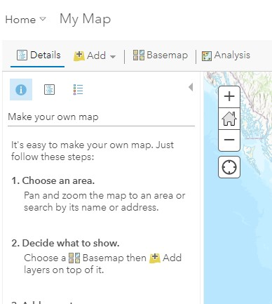
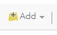
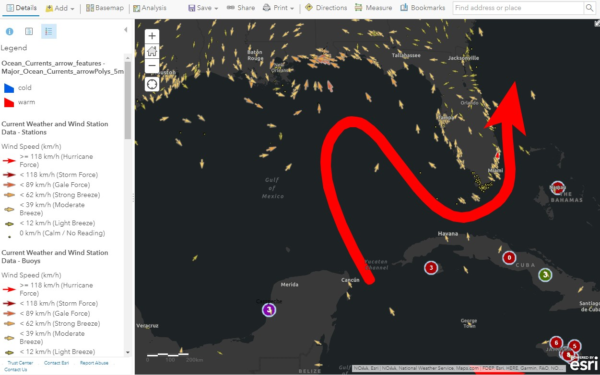
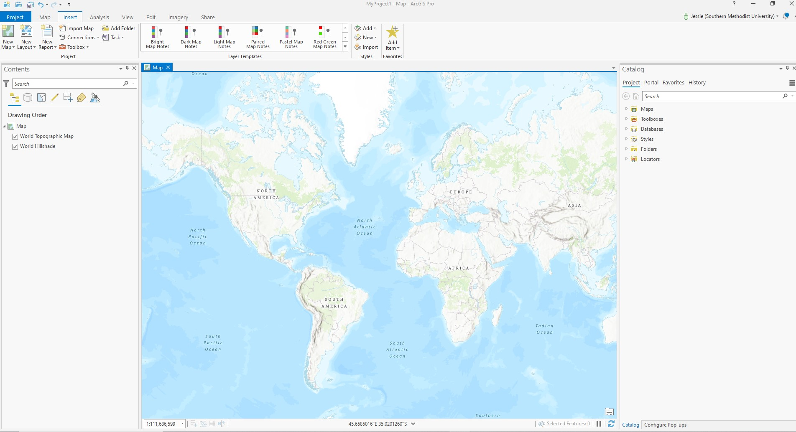
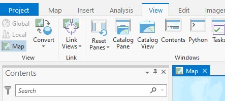

# ImpatientGIS

## Chapter 1
# import point and polygon data into a Geospatial Data System

### 1.1 Quick dip into ArcGIS online

*example: Where were pirates based in the Caribbean, and how do those locations relate to wind patterns?* 

Go to arcGIS online on the web. Sign in.   
https://www.arcgis.com

*This step is partly to test that your sign-in is working - we will need it for ArcGIS Pro.* 

-> Go to '**Map**" 

If online GIS is not familiar then quickly go through the introduction to ArcGIS Online "Make your own map'.

Add data: search for 'pirates', then some more datasets, such as wind, currents, or treasure.  Make a layered map!  

It is easy. 

Don't underestimate Online GIS; it is growing and powerful.  No longer only a visualization tool, every year more analysis can be done Online, with real analysis tools.  Many users won't need more than this. But for us, as Pro users, the biggest value of the online software will be the ease of finding data already loaded within its structure.  

We need desktop software for our larger datasets, and complex analysis. But **Pro** takes advantage of its cousin ArcGIS online (AGOL) through a 'portal' that connects the desktop software directly to online data and other services. 

This chapter will assume you have some confidence with AGOL, and are now ready to use it as the jumping-off point for Pro. 

### 1.2 Jump into ArcGIS Pro

*example: Where are primary schools located in Edinburgh, and how does that relate to neighborhood population

Open Pro, sign in, and open a new map template. 'Create a new project' with the default name and location. Similar to the online GIS, the **Map** window should have the **Contents** window on the left, and the **Catalog** window on the right.

If either window doesn't show up, you can find them under the **View** tab.

**View** -> Catalogue

### 1.3 Get some data:

Make a map. There is tons of open spatial data ready to use on the internet - search for data in Edinburgh. We start our search with the familiar 'shapefiles'. Not really a single file, these 'data-folder' packages contain both geometry imagery and other data files wrapped into a zip package, and are an excellent place to start a data search. 

Search for:
Save it into a folder on your computer- and remember where it is.

### 1.4 Add that data:

The Catalog is the site to add data. But our Folders under MyProject1 lead us to an empty data folder, and and empty MyProject1.gdb geodatabase.  Eventually we'd like to transfer all useful data into that barrel. But first lets just get it onto the map! 

A folder-link can connect ArcGIS PRo to the folder where you data is. **Insert** is the tab to start new stages- maps or cartography. 
**Insert** -> Add Folder -> browse to the folder which *contains* the data you want-> OPEN. 

The folder appears in your Catalogue. 
Click the folder and just drag the data onto your map.

LA women's health NGO wants to build a new clinic in Botswana. location data of existing clinics can reveal the gaps where a new one would be most helpful?* 

*example: A women's health NGO wants to build a new clinic in Botswana. location data of existing clinics can reveal the gaps where a new one would be most helpful?* 

Jump in! First search the internet for *shapefiles* about *health* in *Bostwana*. 

*A **shapefile** is a geospatialdata-file in which information is packaged along with geometries (points or shapes) and their location in the world, usually defined by a lat-long coordinate. Such data can also be saved in a table, with lat.long data, or as a geoJson (a java native geospatial data structure)*.  

You search for Botswana, shapefile, health, and you find the *Bostwana Humnaitarian Data Exchange*. That sounds promising. Narrowing the format options to *zipped shapefiles* reduces the length of the list. I downloaded *Botswana-healthsites* and . Try to avoid raster data which shows, for example population density per-pixel.

Geospatial data vector data has points, lines or polgons

*note: Each chapter builds up an example study to follow. But you can always choose to create a similar study, using a location or question that is more interesting to you.*

