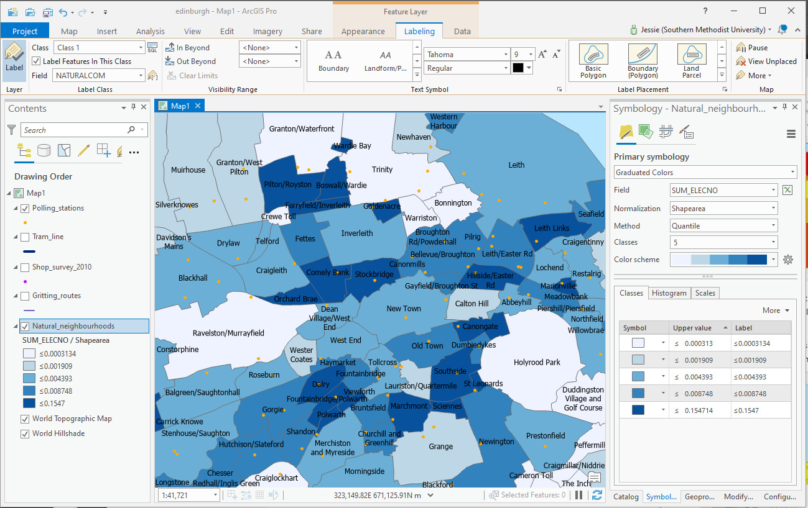

# ImpatientGIS

## Chapter 1
# import point and polygon data into a Geospatial Data System

### 1.1 Quick dip into ArcGIS online

*example: Where were pirates based in the Caribbean, and how do those locations relate to wind patterns?* 

Go to arcGIS online on the web. Sign in.   
https://www.arcgis.com

*This step is partly to test that your sign-in is working - we will need it for ArcGIS Pro.* 

-> Go to '**Map**" 

If online GIS is not familiar then quickly go through the introduction to ArcGIS Online "Make your own map'.

Add data: search for 'pirates', then some more datasets, such as wind, currents, or treasure.  Make a layered map!  

It is easy. 

Don't underestimate Online GIS; it is growing and powerful.  No longer only a visualization tool, every year more analysis can be done Online, with real analysis tools.  Many users won't need more than this. But for us, as Pro users, the biggest value of the online software will be the ease of finding data already loaded within its structure.  

We need desktop software for our larger datasets, and complex analysis. But **Pro** takes advantage of its cousin ArcGIS online (AGOL) through a 'portal' that connects the desktop software directly to online data and other services. 

This chapter will assume you have some confidence with AGOL, and are now ready to use it as the jumping-off point for Pro. 

### 1.2 Jump into ArcGIS Pro

Open Pro, sign in, and open a new map template. 'Create a new project' with the default name and location. Similar to the online GIS, the **Map** window should have the **Contents** window on the left, and the **Catalog** window on the right.

If either window doesn't show up, you can find them under the **View** tab.

**View** -> Catalogue

### 1.3 Get some data:

Make a map. We need some data.
Vector data is the geometric data that forms the backbone of GIS analysis. Some of it is represented as points (such as towns), some of it is lines (like streets) and some is polygons (like countries.)
Make a make with Data from Edinburgh, Scotland. Find out relationships withinin neighborhoods, where people shop, go to school, vote, and the roads they travel on.  There is tons of open spatial data ready to use on the internet. Start searching for the familiar file-type 'shapefile', an excellent place to start a data search. 

*Not really a single file, a **shapefile** is a geospatial data-folder package which containts data, geometries (point, line or shapes) and location, usually lat-long coordinates, all wrapped into a zip package. Such information could alternatively be saved in a table, with lat.long data, or as a geoJson (a java geospatial data structure)*.  

Search for:
**'edinburgh shapefile'**

Find and download some data. There's a useful polygon dataset under **Boundaries** called 'Natural Neighborhoods'.  You will see it has an attribute called "SUM_ELECTNO' of the numbers of people who participated in elections.  Download the Shapefile (not the full dataset). Move it into a folder you name 'edinburgh downloads' somewhere on your computer- unzip it that file - and remember where it is.

While you are on this page, you could also download 'point' data from the 'shop survey' and 'polling stations' and 'line' data for the small Edinburgh tramline and also the 'gritting routes'. (a nice dataset of just those streets that are sufficiently important to receive priority gritting in winter)(A search for 'schools' reveals that there is no 'point' dataset for schools - the polygons for catchment zones are not useful for this exercise).  Move them to your 'edinburgh downloads' folder and unzip them all.  

### 1.4 Add that data:

The Catalog is the site to add data. But our Folders under MyProject lead us to an empty data folder, and and empty MyProject.gdb geodatabase.  Eventually one will transfer all one's useful data into that barrel. But first lets just get what we have found onto the map! 

A folder-link can connect ArcGIS PRo to the folder where you data is. **Insert** is the tab to start new stages- maps or cartography. 
**Insert** -> Add Folder -> browse to the folder which *contains* the data you want-> OPEN. 

The folder appears in your Catalogue. 

YOu can see clearly which is a point, line or polygon type.
Click the folder and just drag the data onto your map: add *'Natural Neighborhoods','shop survey','polling stations','tram_line' and 'gritting routes'.

SAVE. There is no autosave in GIS. And without saving it runs slower. 

Turn off some busy layers. Slide them above or below each other. Select any layer. A new **Feature Layer** series of tabs pop up above the ribbon. 

**Appearance** > **Symbology** > **Symbol** (click on the dot) provides a window to change shape, color, size, fill and boundary color. Figure out, for example, how to remove the boundary of a point and change the color.

**Labeling** > **Lable Class** > **Field** provides options for making text-data visible (NATURALCOM shows the neighborhood names), and changing text style, size and placement. Clicking the **Layer** > **Label** box/image turns them on/off.

**Data** > **Table** > **Attribute  Table** opens the data table behind each layer's visualisation. *(Here you could also export each layer here to extract it from the shapeful folders and save it into your project Global database (.gdb).)*

*(For many tabs there is also a shortcut which one eventually learns: e.g. shortcut to symbology by clicking on the shape in the 'Contents' window, shortcut to attribute table with a right-click on the layer)*

Ask some questions of the data - -

*for example: Which are the primary roads for shopping?*  This might help the city select priorities for extending the tram-lines.

*for example: How does the location of polling stations relate to amount of voting of a neighborhood population?*

**Choropleth maps** to show quantity

Try making graduated colored polygons, to reveal the quantity of electors in each neighborhood. 
Turn off the other layers, and the confusing lables. 

**Symbology > Primary symbology > Graduated Colors > Field > SUM_ELECTNO **(sum of the election numbers).

Not very useful. The biggest population is in the biggest neighborhood- but we'd rather show density.  Normalize the total number by dividing by area **Normalization > Shapearea >

And then test different **Classification Methods** to find one that gives a better spread of colors across the density range. The methods are clearly described in the drop-down. 

Design layer choises, colors, lables and Classification Method to best communicate the issue.  

Clearly some very dense neighborhoods seem to have insufficient polling sites!  Maybe Pilton could use a new site? 

Save the map for future analysis.
