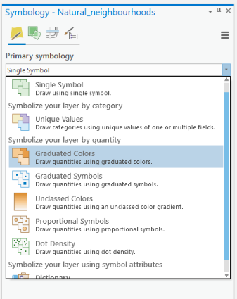
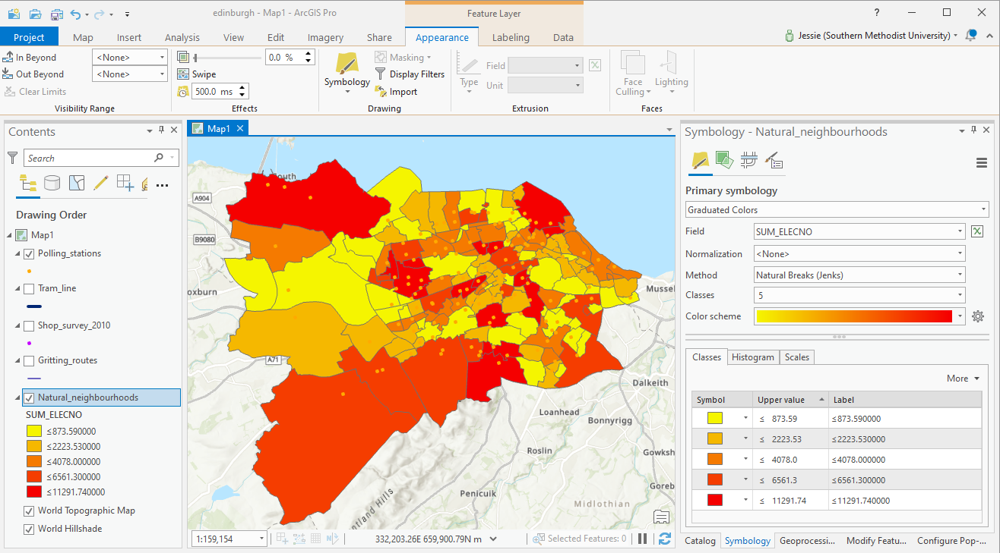
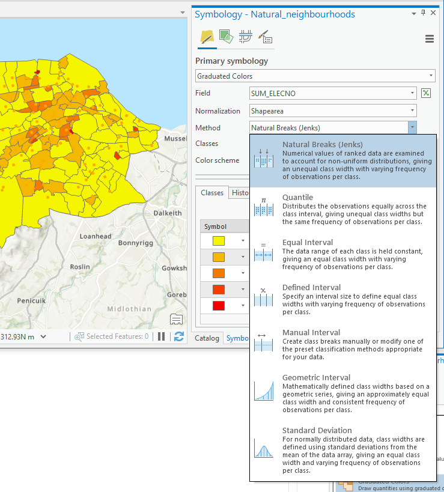
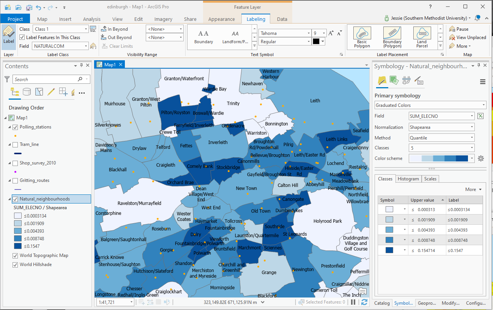

# ImpatientGIS

## Chapter 2
# Visualize Categories and Quantities of Data.

## 2.1 Classify polygon Data

*Invent another Question to ask the data . .How does the location of polling stations relate to amount of voting of a neighborhood population?*

**Choropleth maps** to show quantity

By making graduated colored polygons, one can reveal the quantity of electors in each neighborhood. 
Turn off the other layers, and the confusing lables. 

**Symbology > Primary symbology > Graduated Colors > Field > SUM_ELECTNO **(sum of the election numbers).

Looking carefully at the map, we notice this drawing is not very useful. The biggest population shows to be in the largest areas of neighborhood- but actually we want to show proportionally how many people live in each neighborhood- dependent on its area- ie. we'd rather show density. Find an attribute that gives area.  

Normalize the total number by dividing by area **Normalization > Shapearea >

**Classification Methods**

Then test different **Classification Methods** to find one that gives a better spread of colors across the density range. The methods are clearly described in the drop-down. 

## 1.6 Map Design

Visual communication requires careful observation of the relationships between color, scale and ideas: design the layer choices, colors, lables and Classification Method to best communicate the study issue.  Design it your way!

*Clearly some very dense neighborhoods seem to have insufficient polling sites!  Maybe Pilton could use a new site?*

**SAVE** the map for future analysis.
