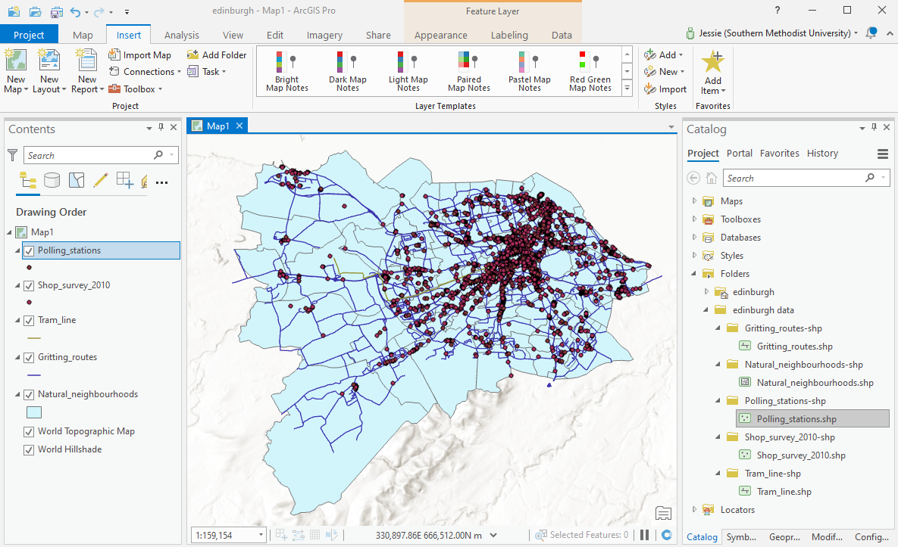
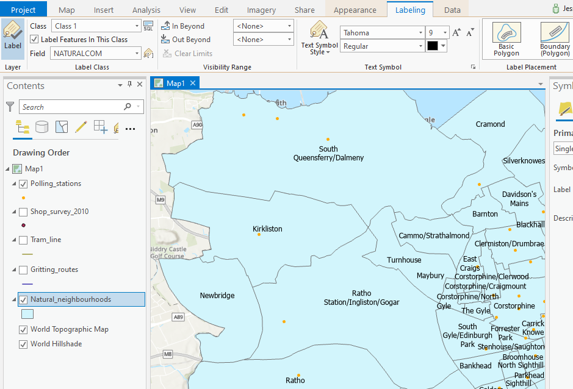
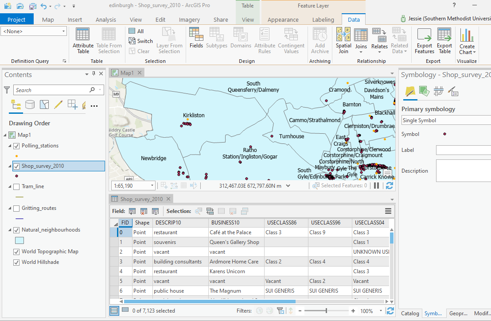

# ImpatientGIS

## Chapter 1
# Import vector data into a Geospatial Data System, and ask a question.

## 1.1 a quick dip into online data (ArcGIS online)

*example: Where were pirates based in the Caribbean, and how do those locations relate to wind patterns?* 

Go to arcGIS online on the web. 
https://www.arcgis.com

Sign in.   ___    *This step is partly to test that your Online sign-in is working - we will need it for ArcGIS Pro.* 

-> Go to '**Map**" 

If online GIS is not familiar then quickly go through the introduction to ArcGIS Online "Make your own map'.

*Ask a question: Where might pirates have left their treasure, and did it have to do with wind and ocean currents?*

 
Add [data] > Search for Layers > My Content V [down arrow to search beyond 'My Content' > AccGIS Online [from the online database of ESRI data], > Search for Layers

Search for 'pirates', 'Add Layer' then just find and add some more datasets, such as wind, currents, or treasure.  Play with the data and make a layered map!  

Don't underestimate Online GIS; it is growing and powerful.  No longer only visualization tool, every year more analysis can be done Online, with real analysis tools.  Many users won't need more than this. But for us, as Pro users, the biggest value of the online software will be the ease of finding data already loaded within its structure.  

We need desktop software for our larger datasets, and complex analysis. But **Pro** takes advantage of its cousin ArcGIS online (AGOL) through a 'portal' that connects the desktop software directly to online data and other services. 

This chapter will assume you have some confidence with AGOL, and are now ready to use it as the jumping-off point for Pro. 

## 1.2 Jump right into desktop GIS: ArcGIS Pro

Open Pro, sign in, and open a new map template. 'Create a new project' with the default name and location. Similar to the online GIS, the **Map** window should have the **Contents** window on the left, and the **Catalog** window on the right.

If either window doesn't show up, you can find them under the **View** tab.

**View** -> Catalogue

## 1.3 Find some Open data

Make a map. We need some data.
Vector data is the geometric data that forms the backbone of GIS analysis. Some of it is represented as points (such as towns), some of it is lines (like streets) and some is polygons (like countries.)
Make a make with Data from Edinburgh, Scotland. Find out relationships withinin neighborhoods, where people shop, vote, and the transit and roads they travel on.  There is tons of open spatial data ready to use on the internet. Start searching for the familiar file-type 'shapefile', an excellent place to start a data search. 

*Not really a single file, a **shapefile** is a geospatial data-folder package which containts data, geometries (point, line or shapes) and location, usually lat-long coordinates, all wrapped into a zip package. Such information could alternatively be saved in a table, with lat.long data, or as a geoJson (a java geospatial data structure)*.  

Search for:
**'edinburgh shapefile'**

Find some point, line and polygon data to practice with:

For each dataset, **Download** the **Shapefile** (not the full dataset). Move it somewhere on your computer into a new folder (in an organised place for all your GIS data) which you name something like 'edinburgh downloads'. **Shapefiles** are packaged in zip folders that must be un-zipped for use. (It is easy to forget.) Unzip (right-click, **extract all**) - and remember where it is.

Download more data:

*'shop survey 2010'* 'point' data  

*'polling stations'*  point data (where people go to vote) 

*'tramiline'* line data (the Edinburgh tramline to the airport)

*'gritting routes'* line data (streets that receive priority for ice-gritting )

*'Natural Neighbourhoods'* is a useful polygon dataset of the way people name their neighborhoods with an attribute called "SUM_ELECTNO' of the numbers of voters. 

## 1.4 Add vector data to a Map

The Catalog is the site to add data, but our MyProject > Folders contain an empty data folder, and empty MyProject.gdb geodatabase.  Eventually good analysts transfer all useful data into that .gdb barrel. But today we are impatient. Lets just get what we have found onto the map! 

The **Insert** tab to start ambitious new project stages- New Maps, New Cartography, New Folders. 
An **Add Folder** connects the catalouge to the folder where you data is. 
**Insert** -> Add Folder -> browse to the folder which *contains* the data (not the data itself)-> OPEN. 

The folder appears in your Catalogue. Open each sub-folder.

Icons describe which is a point, line or polygon type.  Drag each dataset (feature) onto your map.  

**SAVE**. There is no autosave in GIS.

## 1.5 Stroll through the 'Feature Layer' Ribbon

**Feature Classes** (or sets of data) become **Layers**, once you drag them onto a map and visualise them. Turn off some busy layers. Slide them above or below each other. 

Select any layer.  A new **Feature Layer** series of tabs pops up above the ribbon. 

**Appearance** > **Symbology** > **Symbol** (click on the dot) provides a window to change shape, color, size, fill and boundary color. Figure out, for example, how to remove the boundary of a point and change the color.

**Labeling** > **Lable Class** > **Field** provides options for making text-data visible (NATURALCOM shows the neighborhood names), and changing text style, size and placement. Clicking the **Layer** > **Label** box/image turns them on/off.

**Data** > **Table** > **Attribute  Table** opens the data table behind each layer's visualisation. *(Here you could also choose to export each layer here to extract it from the shapeful folders and save it into your project Global database (.gdb).)*

Shortcuts: eventually many Ribbon-tab tasks have quick-access. e.g:

*symbology: click on the shape in 'Contents'*. 

*attribute_table: right-click the layer*

*save: ctrl S*   . . . . . . . . . .Now **SAVE** the map.

## 1.6 Invent a first Question to ask the data . .

*How might one help the City select priorities for extending the tram-lines? What activites could be served by tram? What alternative routes could be proposed?*

