# ImpatientGIS

## Chapter 1
# Import vector data into a Geospatial Data System, and ask a question.

## 1.1 Jump right into desktop GIS: ArcGIS Pro

Open Pro, sign in (using ArcOnline see intro), and open a new map template. 'Create a new project' with the default name and location. Similar to the online GIS, the **Map** window should have the **Contents** window on the left, and the **Catalog** window on the right.

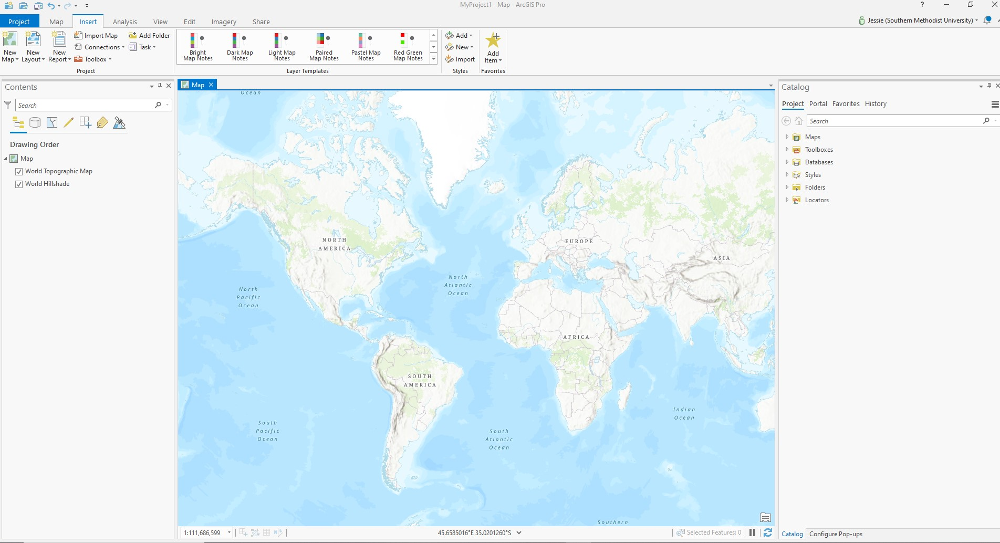

If either window doesn't show up, find and open them under the **View** tab.

**View** -> Catalogue

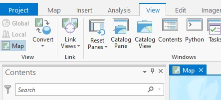

## 1.2 Find some Open data

Make a map. We need some data.
Vector data is the geometric data that forms the backbone of GIS analysis. Some of it is represented as points (such as towns), some of it is lines (like streets) and some is polygons (like countries). There are no more otions.

Make a make with data from Edinburgh, Scotland. Find out relationships within neighborhoods, where people shop, vote, and the transit and roads they travel on.  There is a huge amount of open spatial data ready to use on the internet. Start by searching for the familiar file-type 'shapefile', this is usually an excellent place to start a data search. 

*Not really a single file but a collection of files, a **shapefile** is a geospatial data-folder package which containts data, geometries (point, line or shapes) and location, usually lat-long coordinates, all wrapped into a zip package. Such information could alternatively be saved in a table, with lat.long data, or as a geoJson (a java geospatial data structure). See chapter 6 for how to import these*.  

For a test-run GIS, one could start with any data. In this case, search for:
**'edinburgh shapefile'**

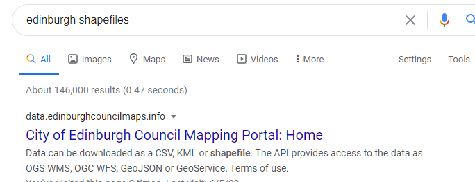

and find some point, line and polygon data to practice with. In this case we could the City of Edinburgh council mapping portal. 

For each dataset, **Download** the **Shapefile** (not the full dataset). Move it somewhere on your computer into a new folder (in an organised place for all your GIS data) which you name something like 'edinburgh downloads'. **Shapefiles** are packaged in zip folders that must be un-zipped for use. (It is easy to forget.) Unzip (right-click, **extract all**) - and remember where it is.

Download more data:

*'shop survey 2010'* 'point' data  

*'polling stations'*  point data (where people go to vote) 

*'tramiline'* line data (the Edinburgh tramline to the airport)

*'gritting routes'* line data (streets that receive priority for ice-gritting )

*'Natural Neighbourhoods'* is a useful polygon dataset of the way people name their neighborhoods with an attribute called "SUM_ELECTNO' of the numbers of voters. 

## 1.3 Add vector data to a Map

The Catalog is the site to add data, but our MyProject > Folders contain an empty data folder, and empty MyProject.gdb geodatabase.  Eventually good analysts transfer all useful data into that .gdb barrel. But today we are impatient. Lets just get what we have found onto the map! 

The **Insert** tab serves to start ambitious new project stages- New Maps, New Cartography, New Folders. 
 **Add Folder** connects the catalouge to the folder where you data is. 

**Insert** -> Add Folder -> browse to the folder which *contains* the data (not the data itself)-> OPEN. 

The folder appears in your Catalogue. Open each sub-folder.

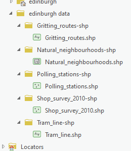

Icons describe which is a point, line or polygon type.  Drag each dataset (feature) onto your map.  
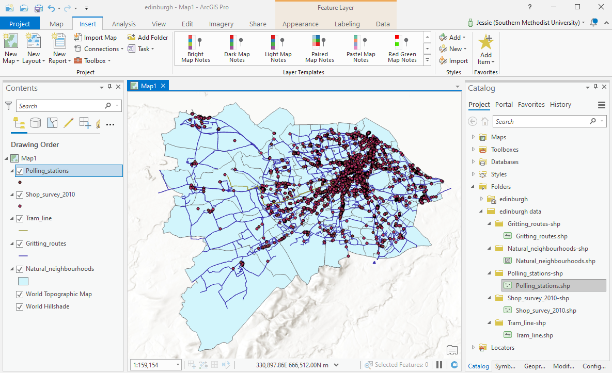

#### ESRI Basemap Data
ArcGIS Pro provides a default cartographic basemap for geographic context.   **Map**  > **Basemap** >  select ‘Light Grey Canvas’ or an alternative basemap.

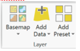 

### Layers 
**Feature Classes** (or sets of data) become **Layers** once you drag them onto a map and visualise them. **Contents** determines layer display order in 'Drawing Order Mode'.  Drag polygon layers to the bottom of **Contents**, and drag points to the top. Turn off one of the busy layers. 

## 1.4 Explore Navigation Tools and Visibility 
GIS navigation is familiar using the mouse and mouse wheel.  Press to Pan, role to zoom. On the **MAP** tab > Navigate > find the various ‘zoom options.  Glide over each tool to describe it.  They’re fairly self-explanatory; try them!

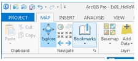 

**SAVE**. There is no autosave in GIS.

## 1.5 Stroll through the 'Feature Layer' Ribbon

Select any layer.  A new **Feature Layer** series of tabs pops up above the ribbon. The **Feature Layer** tab offers primary paths to manipulate and work with layers.  
*(Note: almost every sub-command in ArcGISPro can be found 2 ways; as an icon on the ribbon tabs, or using a right-click short cut via and in the contents, and ‘properties’ familiar from ArcMap)*

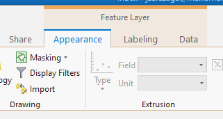

**Appearance** > **Symbology** > **Symbol** (click on the dot) provides a window to change shape, color, size, fill and boundary color. Figure out, for example, how to remove the boundary of a point and change the color.

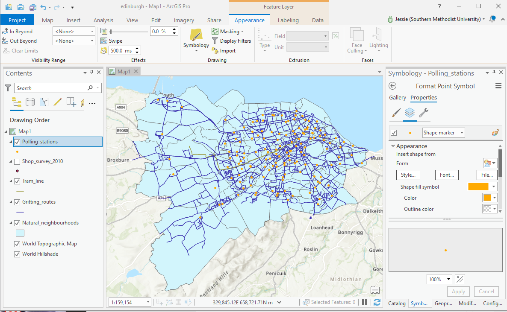

**Labeling** > **Lable Class** > **Field** provides options for making text-data visible (NATURALCOM shows the neighborhood names), and changing text style, size and placement. Clicking the **Layer** > **Label** box/image turns them on/off.

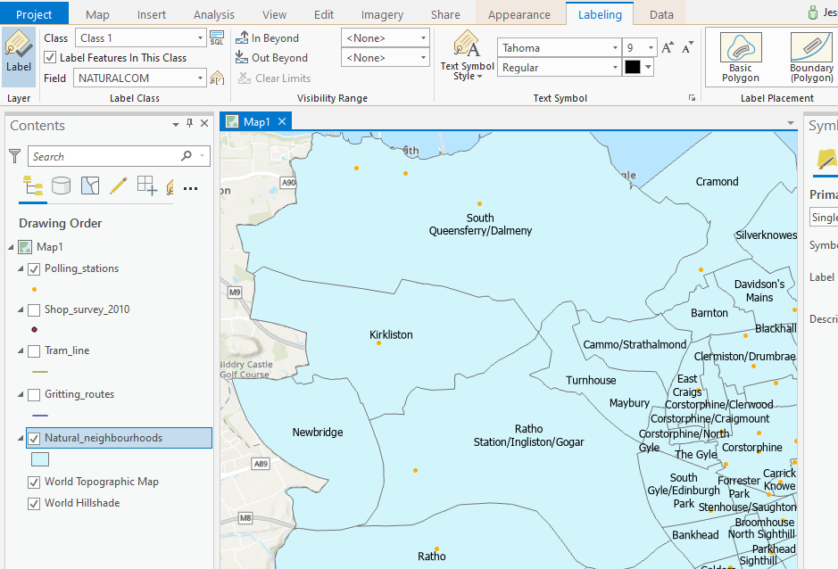

**Data** > **Table** > **Attribute  Table** opens the data table behind each layer's visualisation. *(Here you could also choose to export each layer here to extract it from the shapeful folders and save it into your project Global database (.gdb).)*

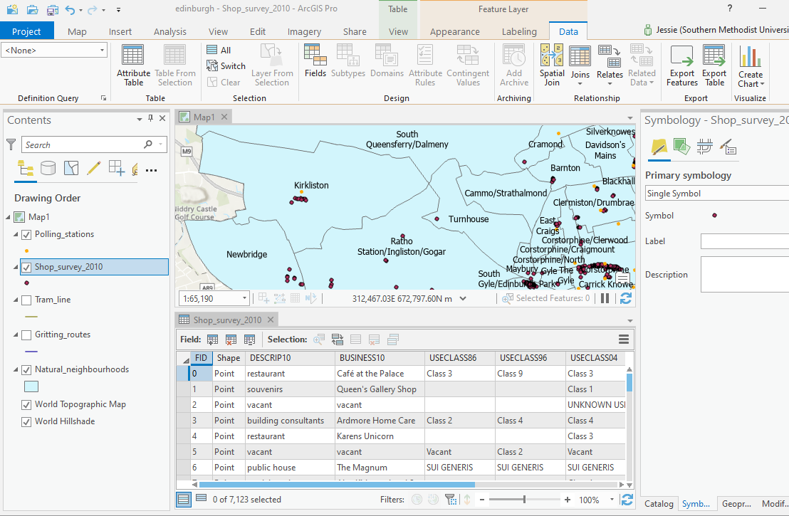

Shortcuts: eventually many Ribbon-tab tasks have quick-access. e.g:

*symbology: click on the shape in 'Contents'*. 

*attribute_table: right-click the layer*

*save: ctrl S*   . . . . . . . . . .Now **SAVE** the map.

Many users of GIS stop here- they download data, make aspects of it visible, and change colors and symbology to reveal the aspects they wish to illustrate. But the most interesting part of GIS is not just to visualize, but to analyse. There are two design issues here- design a map, and then design a reserach question to ask of the data. 

## 1.6 Invent a first Question to ask the data . .

*How might one help the City select priorities for extending the tram-lines? What activites could be served by tram? What alternative routes could be proposed?*

Work with the data. Turn some layers off. Make a beautiful map to reveal the relevant information, and answer the question. 

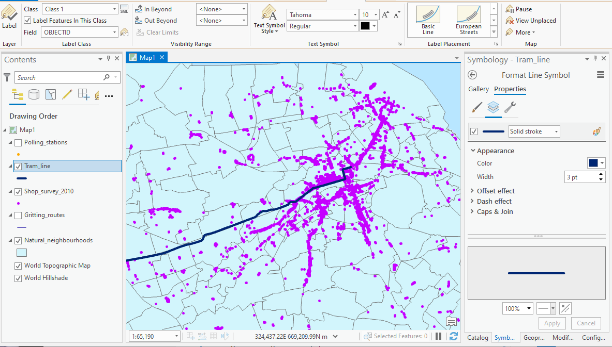