# ImpatientGIS

## Chapter 2
# Visualize Categories and Quantities of Data.

## 2.1 Classify Polygon Data

*Invent another Question to ask the data . .How does the location of polling stations relate to amount of neighborhood participation in this area?*

**Choropleth maps** to show quantity

By making graduated colored polygons, one can reveal the quantity of electors in each neighborhood. 
Turn off the other layers, and the confusing lables. 

**Symbology > Primary symbology > Graduated Colors > Field > SUM_ELECTNO **(sum of the numbers of participants in this neighborhood survey).

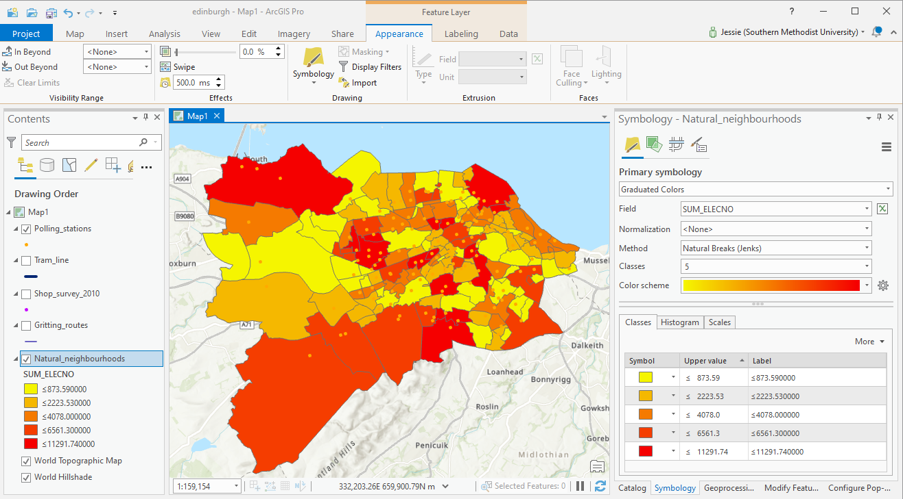

Looking carefully at the map, we notice this drawing is not very useful. The biggest participant population shows to be in the largest areas of neighborhood- but actually we want to show proportionally how active participants in each neighborhood are, dependent on its area- ie. we'd rather show density of participatoin. Find an attribute that gives area.  

Normalize the total number by dividing by area **Normalization > Shapearea >

**Classification Methods**

Then test different **Classification Methods** to find one that gives a better spread of colors across the density range. The methods are clearly described in the drop-down. 

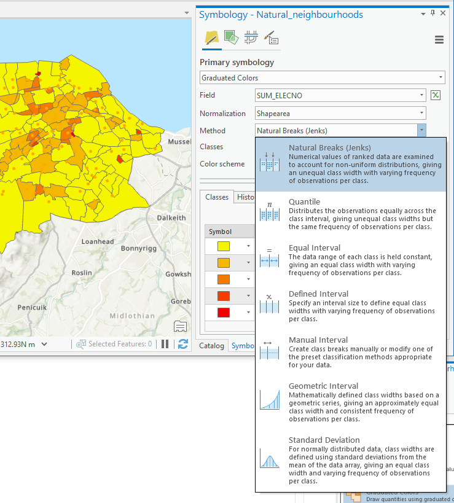

## 1.6 Map Design

Visual communication requires careful observation of the relationships between color, scale and ideas: design the layer choices, colors, lables and Classification Method to best communicate the study issue.  Design it your way!

*Clearly some very active and dense neighborhoods seem to have few council polling sites!  Maybe Pilton could use a new site?*

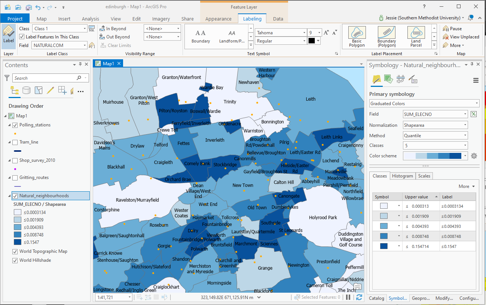

**SAVE** the map for future analysis.

Rather than normalising the data, by dividing by are on the fly, make a new field that will serve as the count of 'density' of neighborhood participation. 

## 3.1 Working with Fields

In the attribute table, Add a field

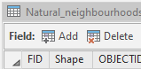

Make a space for a 'float' type for a calculation of activist density. 

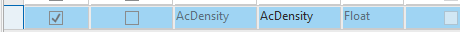

At the top of the window/ ribbon is a new 'save' button for this Field editing session. **Save** the modificatinos to the table.

In the Attribute table, Right-Click on the field to **Calculate Field**
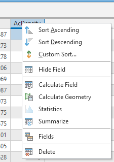

Double-clicking a field name brings that field into the calculation.  Multiply the ELECTNO by 1000 to have density results in sq.m instead of sq.Km.  

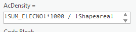 

Run the calculation. Then check the new field. Right-click on the column and **Sort Descending** to check that the field has populated with data. Note that there are many neighborhoods with '0'in this column. 

## 3.2 Visualise that data in 3d
*Where are the most densely active neighborhoods in the city?*

To get the data into 3-d first check our coordinate system - are projecting to a curved surface or a flat surface?

On the Anlysis Tab > Environments >

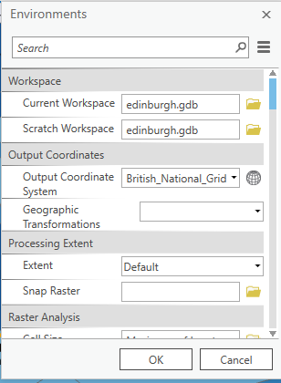 

The British National Grid is like a flattened grad set across the UK. So we will make a local 'scene'.

*The choice between local and global depends on the projection type - how the world is seen on the screen. This specific data came using a 'flattened' projection, like a folded city-map, rather than the geographical system like a classroom globe.*

View > Convert > to Local Scene

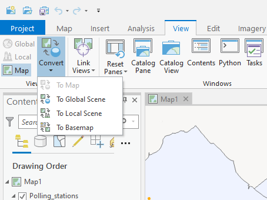

Return to **Map**>Explore> Use the mouse wheel button to zoom back from the 3d model. 

Drag the layer from the **2D Layers** up into the **3D Layers** section in *Contents* to create a volumetric visualisation of the density of activits in SUM_ELECNO.  

Instruct the data to read density as the 'z'value.

**Feature Layer** > Appearance > Extrusion > Type > Absolute Height.
The vertical value **Field** is AcDenisty.

'Units' are meaningly for this 'z' dimension; select 'Kilometers'for now.  

It looks terrible! That vertical value is too high in. Trying 'meters' doesnt seem to help either with the vertical proportion - it is too low.

Create a new custom 'Field' expression.   
 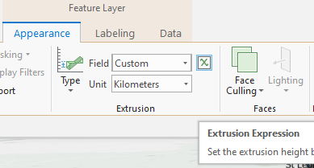
 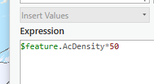
 
 Double-click on 'AcDenisty' and multiply by something like 50.  

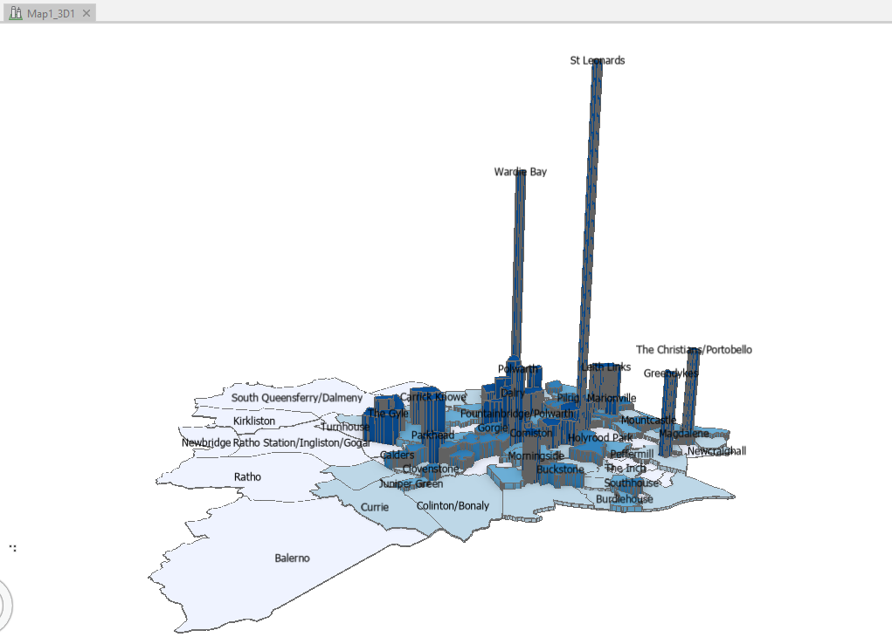
