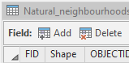
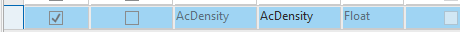
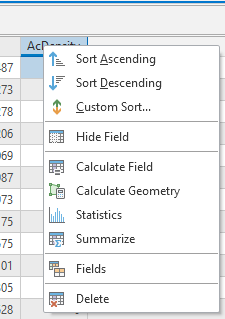
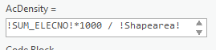

# ImpatientGIS

## Chapter 3
# Visualize Categories and Quantities of Data.

Rather than normalising the data, by dividing by are on the fly, make a new field that will serve as the count of 'density' of neighborhood participation. 

## 3.1 Working with Fields

In the attribute table, Add a field

Make a space for a 'float' type for a calculation of activist density. 

At the top of the window/ ribbon is a new 'save' button for this Field editing session. **Save** the modificatinos to the table.

In the Attribute table, Right-Click on the field to **Calculate Field**

Double-clicking a field name brings that field into the calculation.  Multiply the ELECTNO by 1000 to have density results in sq.m instead of sq.Km.  

 

Run the calculation. Then check the new field. Right-click on the column and **Sort Descending** to check that the field has populated with data. Note that there are many neighborhoods with '0'in this column. 

## 3.2 Visualise that data in 3d
*Where are the most densely active neighborhoods in the city?*

To get the data into 3-d first check our coordinate system - are projecting to a curved surface or a flat surface?

On the Anlysis Tab > Environments >

 

The British National Grid is like a flattened grad set across the UK. So we will make a local 'scene'.

*The choice between local and global depends on the projection type - how the world is seen on the screen. This specific data came in using a 'flattened' projection, like a folded city-map, rather than the geographical system like a classroom globe.*

View > Convert > to Local Scene

Return to **Map**>Explore> Use the mouse wheel button to zoom back from the 3d model. 

Drag the layer from the **2D Layers** up into the **3D Layers** section in *Contents* to create a volumetric visualisation of the people-count in SUM_ELECNO.  

Instruct the data to read people-count as the 'z'value.

**Feature Layer** > Appearance > Extrusion > Type > Absolute Height.
The vertical value **Field** is SUM_ELECNO.

It looks terrible! That vertical value is too high.  AND, as before, it is absolute value of people. We need to normalise that number again by dividing by area, and then select a better vertical proportion.

Create a new custom 'Field' expression.   
 
 Double-click on 'SUM_ELECNO' and divide by 'Shapearea'. Numbers are all <1 so multiply SUM_ELECNO by 100.  
 
 **$feature.SUM_ELECNO*100/$feature.Shapearea**
 

'Units' are meaningly for this 'z' dimension; select one that looks good. 'Kilometers' seems to allow a good vertical spread here. 

