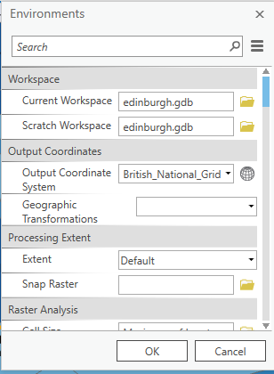
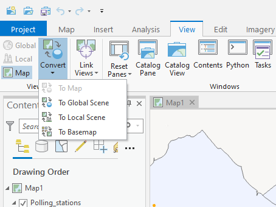
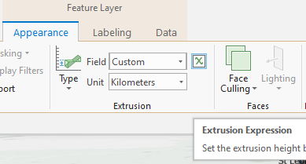
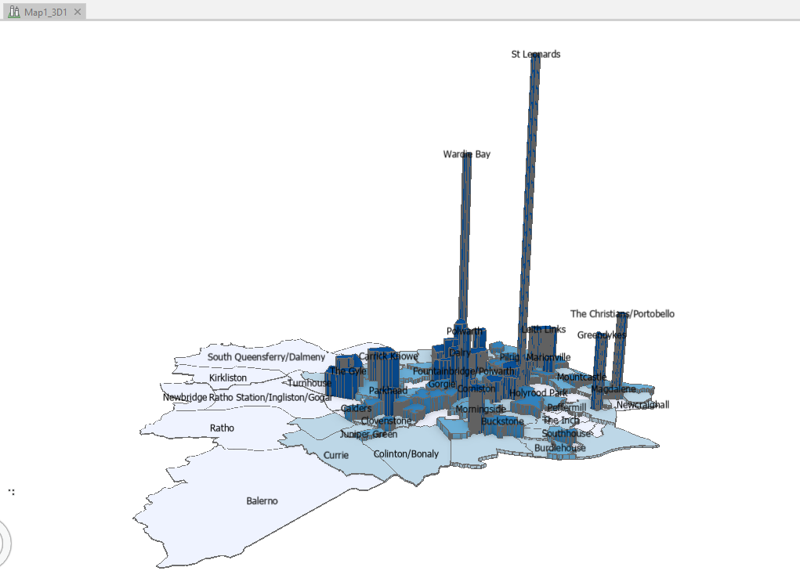

# ImpatientGIS

## Chapter 3
# Visualize Categories and Quantities of Data.

## 3.1 Visualise that data in 3d
*Where are the most densely inabited parts of the city?*

To get into 3-d we need to check our coordinate system - are projecting to a curved surface or a flat surface?

On the Anlysis Tab > Environments >

 

The British National Grid is like a flattened grad set across the UK. So we will make a local 'scene'.

*The choice between local and global depends on the projection type - how the world is seen on the screen. This specific data came in using a 'flattened' projection, like a folded city-map, rather than the geographical system like a classroom globe.*

View > Convert > to Local Scene

Return to **Map**>Explore> Use the mouse wheel button to zoom back from the 3d model. 

Drag the layer from the **2D Layers** up into the **3D Layers** section in *Contents* to create a volumetric visualisation of the people-count in SUM_ELECNO.  

Instruct the data to read people-count as the 'z'value.

**Feature Layer** > Appearance > Extrusion > Type > Absolute Height.
The vertical value **Field** is SUM_ELECNO.

It looks terrible! That vertical value is too high.  AND, as before, it is absolute value of people. We need to normalise that number again by dividing by area, and then select a better vertical proportion.

Create a new custom 'Field' expression.   
 
 Double-click on 'SUM_ELECNO' and divide by 'Shapearea'. Numbers are all <1 so multiply SUM_ELECNO by 100.  
 
 **$feature.SUM_ELECNO*100/$feature.Shapearea**
 

'Units' are meaningly for this 'z' dimension; select one that looks good. 'Kilometers' seems to allow a good vertical spread here. 

