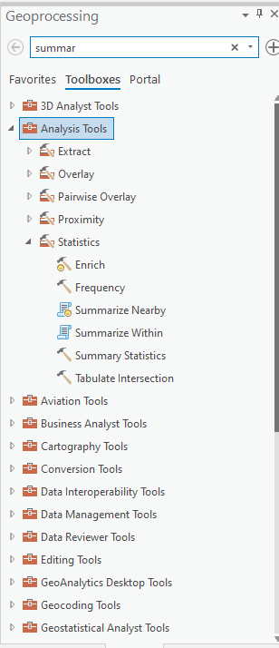

# ImpatientGIS

## Chapter 3
# Visualize data: show quantities and categories

Neighborhood activists need good places to meet, like cafes or pubs. Find out whether the level of activism has any relation to the number of cafes. 

## 3.1 Extract one category (attribute) from the dataset
Back to the 2d map. 

Turn on the layer for *Shops*, and select a sub-set of the data that is ONLY those hops that are cafes, restaurants and pubs. Then extract that as a separate layer and dataset.

**Select by Attribute**

Shop-survey has an attribute called 'Descrip10' with use type. Right-click and 'Sort Ascending' to read through the list of names.  Its not a very tidy data-set. Note that there are sometimes several similar names for the same sort of use. You could, however, use this information to select those uses, and then export the selected data to create new layers - first extracting coffeeshop/cafes, and also pubs/bars. (but it takes a long time since the data is messy)
However there is also another useful attribute called 'CLASS10'. The class type 3 appears to map fairly nicely to the combination of cafes, bars and restaurants that we were looking at. In order to select restaurants and bars - one can 'select by attribute' in CLASS 10

**Map** > Select by attribute > useclass10 = Class 3

This selection is now visible in the table.

Export those selected features to create a new data set. 
**Data** > Export Features > Feature Class to Feature Class

The is a geoprocessing tool - a first, fairly simple manipulation of data.

This new dataset will be placed INSIDE the globaldatabase (.gdb) which is connected to the Map. *One can use the 'export features tool to export the whole dataset, into the gdb, or to export only certain elements of it, as here.* 
[is this where I expalin that the data is not inside the map but connected to it?]. This barrel of data is and ESRI format for collecting numerous different types of data together into one packet, and is really useful for working between Pro and online GIS.  The advantage of having one's data in a geodatabase, apart from simplicity is a reduction in the personal level of organisation needed - the links betwen the data and the map are solid and one reduces the tendency to have a map with dreaded red questions marks. The disadvantage is that in order to be independently saved and shared, datasets have to be re-exported as shapefiles.   

After using the select tool, remember to **clear** the selection.

The restaurants and cafes seem to be more connected to the road pattern than the neighborhoods.

Rather than extracting data according to its attributes it can be extracted according to its location. 

*How many cafes and restuarants are within 0.5 km of the tram line?*

## 3.2 Visualize data: Heat Map & dot density

Clearly cafes and restaurants are not well distributed. Messing around with the **symbology** allows differnt visualisations of the same data- giving options for communicating the story in different ways.

**Appearance** > Symbology > Primary Symbology > Heat Map
This symbology reveals the density of points in a dataset. 

This visualization allows one to see that the center of the city is the most densly provided with eaterys. 

Changing the symbology of the neighborhood layer allows one to see very clearly that there are indeed active neighborhood zones which could use a new community cafe!

## 3.3 Visualize data: Statistics

One can use simple geospatial statistics tools to give specific numbers to this calculatoin, creating a more acurate visualisation of the same data. 
*How many bars and restaurants are within each neighborhood? What is the density of cafe's per neighborhood?*

There are over 200 tools in ArcGIS Pro, and other GIS softwares. Some tools are used frequently, and some are only used by specialists in their own area.  Many GIS tasks become so common one forgets they are geoprocessing tools. 
For example, the tool **Feature Class to Feature Class** (when one attribute of the data was exported to create a new layer) was actuallly a geoprocessing tool.

Some of the most common tools appear as icons in the **Analysis ribbon. But most tools are in the toolbox. 

The next chapter will jump into various different kinds of **Spatial Tools**.  Statistics are **Analysis tools**

**Analysis** > Tools > **Summarize Within** > 

The new CafeBar)neighborhoods layer, (which has been saved in the geodatabase) can now be symbolised as a polygon layer, to show those neighborhoods that have more, and fewer, cafes.

And this new data can be shown in relation to the tram line, to build on a discussion of development of that line. 

