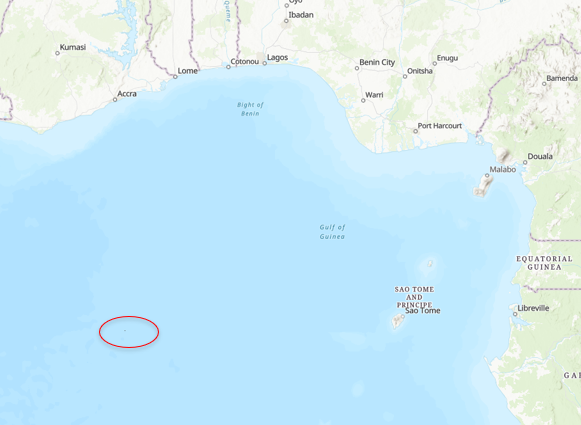
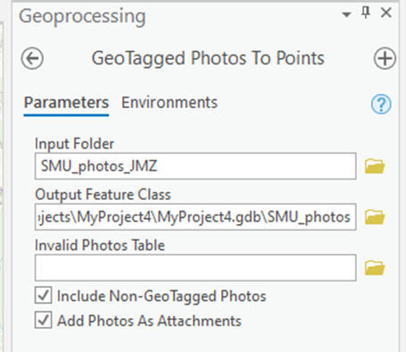
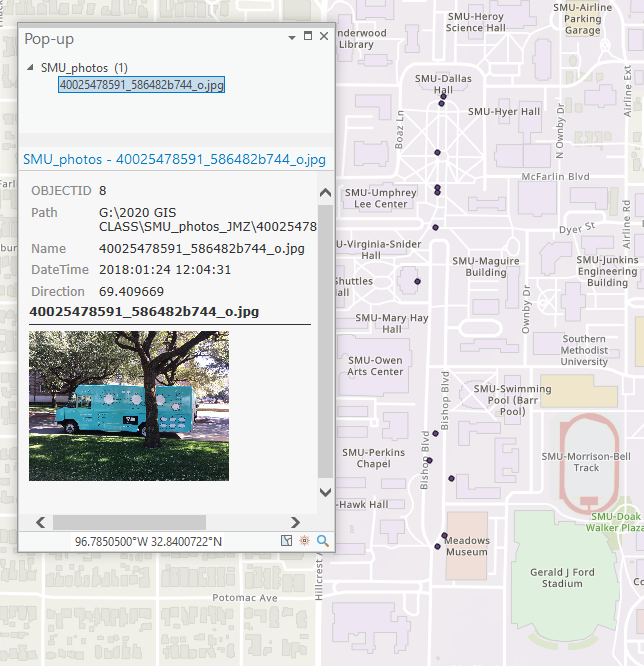
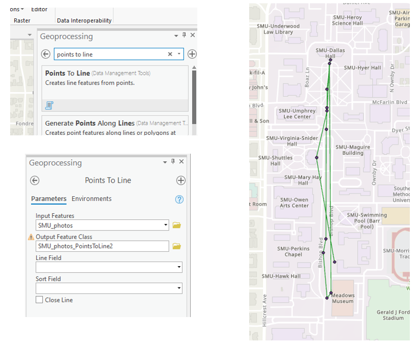
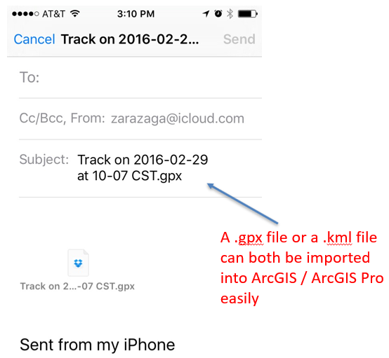

# ImpatientGIS

## Chapter 4B
# Gather and Create new Data.

## 4.1 Gather point data with photographs

THe edinburgh study began with a search for shapefiles.  But much spatial analysis is dome wiht original data, gathered in the field. Gathering field data for GIS has one limit - it must include spatial information: GPS or Lat/Long data. A simple first way to gather GPS data is to make use of the in-built GPS in a smartphone. Although not top quality, a smartphone GPS is sufficient for many sitautions. 

Most phones have a default to add spatial data to photographs, so the easiest way to gather point data is by taking photos. The image itself is irrelevant- a photo of the ground will contain the same GPS data. Check that your photos include location data (swipe-up or details). Then gather a test-run set of photos, download them to the computer and save them in a 'photowalk' folder. ArcGIS default is for Landscape or horizontal photos. You can work around vertical photos by re-saving, but it's extra steps.

## 4.2 Viualise images on a Storymap
From within ArcGIS online, click on the 'grid of 9' for the app dropdown list, and open 'StoryMaps'. A useful app for making presentations integrating maps, it also has a quick-start tool 'guided map-tour' which presents a slide show of photos organised through a sequential series of map-points. Browse to the 'photowalk' folder to create a tour.  Making the map public, publishing and sharing it, allows the creation of a short url. very useful for public presentations or academic talks!

## 4.3 Import photos to Pro as a point feature set.
Open a new Map in Pro, add a folder () and navvigate to the 'photowalk' folder. First try dragging a photo onto the map.
Right-click and ‘zoom to layer’, then zoom out a little. The image has probably been dropped in the ocean west of Africa. Why?

“Null Island” is the location of non-georeferenced data. The imagery itself, the raster data, is being treated by Pro as if it were a satelite imagery. However this is just a photo, and it is not georeferenced, so it has been dropped at 0,0. However there is GPS data attached to the photo. 

Use the geoprocessing analysis tool ' GeoTagged Photos to Points' to extract the GPS data from the set of images, and to create a single feature-set from the series of data points in the photo-walk. 
**Analysis** > tools > Geoprocessing > (type into 'Find Tools') *GeoTagged Photos to Points* (Data Management). NAvigate to the 'photwalk' folder without opening it. Import the geotagged digital photographs into your map. 

The tool creates a point feature class in the map.  By default, the feature set with the new points is saved directly into the map's geodatabase. As an option, the tool also attaches the photos to the point feature class. By clicking on a point, the photo can be seen in the pop-up. ('Pinned pop-up' allows the display of more that one image at once.)

## 4.4 Illustrate the path taken as a line
The photos are also stamped wtih time and date. Returning to the Geoprocessing window (which can be done using the small back-arrow next to the search box), the tool 'Points to line' makes use of this hidden-data by using that time-stamp to create a line which connects the photo-points in the order in which the images were snapped. 

**Analysis** > tools > Geoprocessing > *Points to line*. Once again this new layer with this line is also saved into the geodatabase (gdb), as a new feature-set.

## 4.5 Import a GPX path, or a series of GPS data points
Instead of gathering points as photos, its possible to gather the data of a path by using a GPS tool, such as a garmin, or a tracking tool which has been programmed to request satellite location data with a 'dot' or time-stamped location, every few seconds. Fortunately many smart-phone apps are already designed to do this, in order to create, for example, tracking of hiking or running. In the search for a free GPS phone app, look for any that allow downloading of the GPS. or GPX. data, usually explorted as an attachment to an email. Then run around and gather some test data!

Within Pro, **Analysis** > tools > Geoprocessing > *GPX to Features* imports the GPX data into the geodatabase, and creates an attribute table with the point and location data. THe data will appear as a series of dots. Re-use the points-to-line tool once again to create the path.

## 4.6 Import KML or other pypes of spatial data
Some phones will export the spatial data as a KML file rather than a GPS file. This is a different way to package the data, but works in the same way.   **Analysis** > tools > Geoprocessing > *KLM to Layer* .  KML is the language that google maps uses to store geospatial data, such as location of stores. Data gathered in a google-maps format can be exported from "My Maps" as a KML file, downloaded, and then imported into an arcGIS Pro map, allowing you to integrate data gathered from different origins, in order to undertake analysis. 

## 4.7 Collect complex attributes and spatial data, with a Survey
These strategies above describe ways to specify the site of specific points, and reproduce a lat/long location within a GIS map. However most useful data contains much more information that just the location - the name of the place, the time it was collected, a variety of classes and values that are characteristics of each point of the data collected. Within the ESRI range of apps which are designed to seamlessly interact, the SURVEY 123 app allows one to design a fairly complex data collection system, with drop-down menus to ensure consistent data classes, and a photo and map-location option to secure spatial data.  Find the app in the 9-grid of apps on ArcGIS online, and test a data gathering survey, such as location and type of trees nearby.  The app is self-evident and doesnt require training, but the data, once collected, can seamlessly be imported into the arcGIS pro map, and used for analysis. 