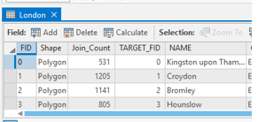
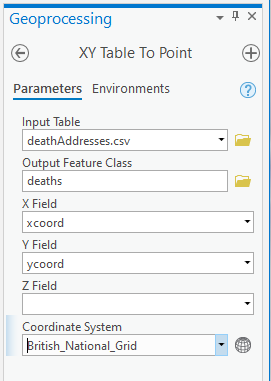
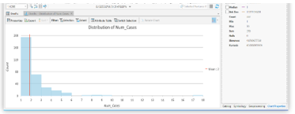
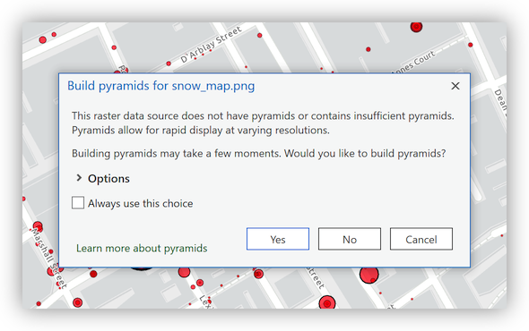
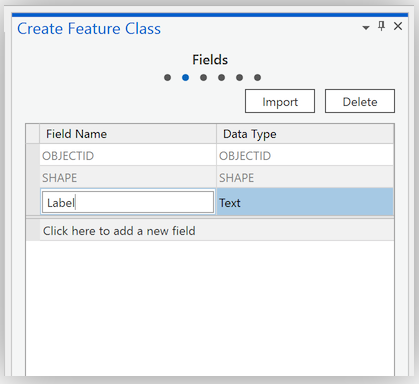

# ImpatientGIS

## Chapter 4
# Get started: Georeference and Geoprocessing.

*based on workshop by Stacey Maples, Geospatial Manager, stacemaples@stanford.edu Stanford Geospatial Center*

 The history of modern epidemiology is tied up with the history of mapping. 

https://www.youtube.com/watch?v=VJ86D_DtyWg

https://www.history.com/topics/19th-century/mankind-the-story-of-all-of-us-videos-cholera-video

## 4.1 Work with data

Download the zip folder:  https://github.com/zarazaga/ImpatientGIS/tree/master/Ch4data 
Right-click the *.zip and Extract All.  

* **snow_map.png** - a non-georeferenced image of the map from John Snow’s original report on the cholera outbreak of 1854.

* **deathAddresses.csv**  - a table of addresses affected by the cholera outbreak, their latitude and longitude coordinates, and the number of deaths at each address.  

* **London.shp** - the boroughs of the modern city of London.

* **Study_Area.shp** - a rectangle describing the area of interest.  

*backup data folder contains versions of files created during the workshop.* 

## John Snow's 'snow_map’


This is the famous map drawn by Dr John Snow, the founding father of modern epidemiology.  London suffered a series of cholera outbreaks during the mid-19th century, and Snow theorized that cholera was spread through contaminated water, rather than the prevailing theory of spread through "miasma" in the air.  London's water supply system consisted of shallow public wells where people pumped water to carry home; the sewage system of privies emptied into cesspools or cellars. The pervasive stench made the miasma theory very plausible. 

During the 1854 cholera outbreak Snow mapped the 13 public wells and all the known cholera deaths in the Soho district, and noted the spatial clustering of cases around the Broad Street water pump.  He managed to have the pump handle removed from the Broad Street pump and the outbreak quickly subsided. Arguing against traditional medicine, Snow subsequently published a map of the epidemic to support his theory, showing the locations of the 13 wells and the addresses of the 578 cholera deaths, marked as stacked black bars.  

Explore the cholera outbreak of 1854 and re-determine whether there is evidence that the Broad Street pump is the source of the outbreak. Map the locations and numbers of the cholera deaths, and geospatially compare them to the nearest water pumps.

### 4.2 Illustrate London's population density

Open a new ArcGIS Pro document and **Insert** > New Map.

Add London Borough data: **Insert** -> Add Folder -> browse to the folder which *contains* the data (not the data itself)-> OPEN. 

Browse to the folder > **data > London_Borough.shp**. Drag the shapefile onto the map.

  
Look at the attribute table to figure out what data is part of this layer that we could use to illustrate population density. 

**Feature Layer** > *Data* > attribute table *( or shortcut- right-click layer)*

 

The column  POPDEN, describes the population density of each London borough. 

Change the symbology to show relative population density. 
**Feature Layer** > Appearance > Symbology > slide down to **Graduated Colors**

Field > **POPDEN** > Select *quantile* classification method to show equal numbers of boroughs per class.

 

Lable the Boroughs: **Feature Layer** > *Labeling* > ‘Label’> default Field 'Name'. 

*(For clarity one could turn off this layer while working on the new layer)*

### 4.3 Compare Historic area of disease to today's population density. 

The 'Study Area' polygon describes the zone of John Snow's study. Compare its location to the areas of density in modern London.

Catalog > drag **Study_Area.shp** onto the Map. Zoom into the small square *(or right-click to ‘zoom to Layer’)*
**Appearance** > Symbology > properties > change the fill to 'No_Color', and the border line to a strong color, to make a square frame instead of a colored square.  


#### Spatial Bookmarks

To easily return to this area of interest, one can create a spatial bookmark: **Map** > Bookmarks  > New Bookmark > Name it **“SOHO”**. 

Zoom back out to the density map; and make sure the 'study area' sqaure frame is visible, then test **Map** > Bookmarks > Soho to return.

*Now one can have a discussion about areas of high historic and current population density in central London.  One could even show this population density in 3D, as in Chapter 2*.  

**Save.**
*(Turn off the 'London Boroughs' layer)*

### 4.4 Create a new Data layer from an XY table

The dataset in the folder which describes the locations where deaths from Cholera happened, is a table, not a spatial data set.  Open it. Each line in the table is an address, with the number of cases at the adress, the address writen as text, and the latitude and longitude coordinates of these addresses.  
*Notice how small the longitude number is- why?*

Catalogue > drag  ‘deathAddresses.csv file onto the contents window.

 **Map** Tab > Add Data >  **Add XY Point Data**. This will open the *‘Geoprocessing’* tools window, with the tool: **XY Table to Point**.  *(Also find under Analysis > Tools > search for ‘XY’)*. 


Under **Output Feature Class**, note that the new feature class will be exported to the ‘globaldatabase (gdb) as the default location for all new data.  
Replace the default name with "**Deaths**" and remaining settings as shown: *(make sure the coordinate system is GCS_WGS_1984)*



**Run**. Points are added to the **Map** and the new layer to **Contents**.


### 4.5 Statistics on a field  

Obtain a simple statistical snapshot of the number of deaths at each address from the data in the Attribute Table. *(Make sure the layer is selected).* 

Open the Attribute table: **Feature Layer** > Data > Attribute Table  *(Shortcut:right-click)*
 **Num_Cases** shows the number of deaths at each address. Right-click on the header of **Num_Cases** and select **Statistics**.  A histogram of the data distribution will appear over the top of the Attribute Table, and a "Distribution of Num_Cases" panel will appear in the tabbed panel area on the right. 

   

### 4.6 Show more deaths with Proportional symbols 

The dots are all alike. Change the symbology to show, with the size of the circle, the different numbers of people who died at each address.  
 **Appearance** > Symbology *(Or right-click)* Change 'Single Symbol' to **Proportional Symbols** and set Field = Num_Cases.  
 In the **Histogram** the range of values for the Num_Cases was 1-18. So set Minimum size = 1.00 and Maximum size = 18.  On the Template for **symbol** select a larger circle- say Circle 3 at (40%). 


#### Set a reference scale for Zooming

The circle symbology remains the same size as one Zooms in and out of the Map, regardless of the viewing scale.  To keep it proportional change the properties of the WHOLE map-frame. 
Right-click on **Map** at the top of the **Contents** > Properties >  **General** > change the **Reference scale**  to 1:5000 > OK .
Symbols now change size along with the zooming of the map. 

### 4.5 Create new Data: Georeference a paper map  

To determine whether there is evidence that the Broad Street pump was the source of the cholera outbreak of 1854, one needs to know which deaths took place near which water-pumps. Each death address must be allocated to a pump according to its proximity to that pump.  
First we need the locations of the historic pumps, data which must be extracted from John Snow's original 1854 cholera outbreak map, by ovelaying the paper map onto the correct site within our GIS, and tracing the points off it. 

Catalogue > data folder > drag **snow_map.png** into the **Map**. 
*(Click Yes if you are prompted to "Build pyramids". If it doesn’t prompt, you might need to come back to this and right-click on the layer.)*

Where is it? Added to **Contents**, the layer isn't visible in the Map. Right-click > zoom to layer.  It is probably in the ocean! The GIS has no reference to identify where this map should be located in the world. 

#### Georeference

Select *snow_map.png* >  **Imagery** tab > Georeference icon, to open the **Georeferencing** Tool bar > Georeference.

  

Right-click > "Zoom to layer *snow_map.png* > use the mouse scroll button to navigate to the upper left corner of the image, and find *Regent Circus* .
Georefence Ribbon > **Add Control Points** > place 'Control Point' at the center of *Regent Circus*.  
  
Right-click > "Zoom to ...  *Study_Area*> mouse scroll wheel zoom into the same area of *Regent Circus*, and place the second **GCP** link at that location. The map image will automatically "snap" these two GCP links together. *(If it remains invisible, save and close georeferencing, then re-open. This just happens sometimes)* 

  

Similarly, use the scroll wheel to navigate to the bottom right corner of the 'snow_map.png' layer to find the intersection of *Oxendon Street & Coventry Street*. This is an intersection that has remained consistent through the city development.  Add a **Ground Control Point** link at the intersection.
Toggle off the visibility of the 'snow_map.png' > right-click > Zoom to..*Study_Area*. 
Locate the corresponding intersection in the now visible basemap and place the second link of the **Control Point**. 
Turn on the 'snow_map.png' layer to check that it has "snapped" these two links together, as before. 

Locate and place 3 more **Ground Control Points** (1 in each remaining corner and one near the center).  Try Soho sqaure! 


In case of a mistake, open up the **control point table**.  Turn off each point one-by-one to see which is faulty, then select and delete that point. 
The **Georeference** tools operate within an external editing session; one needs to separately save this session with the **Save** button of the toolbar, then **Close Georeference**. 

*Observation: In Windows Explorer, browse to the **data** folder; note that new files have been added including **snow_map.png.pgwx**. This is the "World File" for the image just georeferenced; as long as this file accompanies the **snow_map.png** file, all GIS applications, such as Google Earth, ArcGIS, QGIS, etc.. should be able to co-locate this image with other datasets.*

 
### 4.6 Create new Data: Digitize features from a georeferenced map

*(If the last section didn't go well, add the `John_Snow_Map.tif` from the backup_data )* 

In order to trace, and digitize the locations of the **Water Pumps** in the neighborhood, from the paper map, an empty layer must be created in the .gdb to hold those new points.  

Catalog panel > **Databases** > right-click on **Default.gdb** > **New > Feature Class**   
  
Create Feature Class > Define >  **Name:** pumps; **Alias:** Water Pumps; **Feature Class Type:** Point > **Next**.  
  
 **Field Name:** Label; **Data Type:** Text. > **Next**.  
  
Set the **Spatial Reference** to **GCS WGS 1984** (find it under 'layers') >  **Finish**. 
   


### Add points to the Feature Class


Drag the new **pumps** Feature Class into the Map. The layer is added to Contents, with the alias: **Water Pumps**. 

WHY?((Open the **Attribute Table**: Water Pumps layer > **Feature Layer** > Data > Attribute Table *(or right-click)*. ))


Select the **Water Pumps** layer > **Edit** Tab > activate the **Edit** tools ribbon. 

  

Click on  **Create** tool > a set of templates for each vector data layer appear in a panel on the right.
  
5. Click on the **Water Pumps** template, in the **Create Features** panel on the right, to select the Water Pump point.  
6. Locate a Water Pump in the **snow_map.png** layer and click on it to place the point. 
7. In the Attribute Table, below, double-click on the new record, under the **Label** field and enter a value for the Label field (we will use the name of the nearest street), and hit **RETURN**.
8. Repeat for the remaining 12 water pumps in the Snow Map. (13 pumps in all; some right near the edge.)  
  
9. Click the **Save** button and confirm to save your edits.  Close the **Create Features** Panel to close the edit session.
Close the Water Pumps Attribute Table.
 Zoom to the Water Pumps.
12. Toggle off the visibility of the **snow_map.png** layer.  
  


### Finding an already georeferenced map from DavidRumsey.com

There are many venues for searching for old maps as sources for spatial data and I've listed a few below. Of course, there are many considerations of scale, authority, projections, etc.when using a scanned map as a data source, it is possible to scan and georeference just about any map you can find reference data (another map to georeference to) for.

* [earthworks.stanford.edu](earthworks.stanford.edu)
* [DavidRumsey.com](DavidRumsey.com)
* [OldMapsOnline.com](OldMapsOnline.com)

We'll start by looking at this map [[Gegend von London 1853](https://www.davidrumsey.com/luna/servlet/detail/RUMSEY~8~1~298861~90066747:Gegend-von-London-1853?sort=Pub_List_No_InitialSort%2CPub_Date%2CPub_List_No%2CSeries_No&qvq=w4s:/where%2FLondon%2B%252528England%252529%2Fwhen%2F1854;q:london%201854;sort:Pub_List_No_InitialSort%2CPub_Date%2CPub_List_No%2CSeries_No;lc:RUMSEY~8~1&mi=1&trs=2)] of London on [https://davidrumsey.com](https://davidrumsey.com). It already has a "**Georeferenced** version, which can be viewed by clicking on the **Georeferencer** button at the top of the page.


David Rumsey makes Open Geospatial Consortium (OGC) compliant services available for  georeferenced maps on his site. This means that you can use the maps directly in most modern GIS applications, including ArcGIS Pro, QGIS, ArcGIS Online, etc.

### Adding a DavidRumsey.com WMTS map Service to ArcGIS Pro

YOu have to sign into the goreferencer, and look for the WMTS link. 


To save a step, hHere is the **Web Map Tile Service WMTS URL** for the Gegend map:  

```http
https://maps.georeferencer.com/georeferences/28da2318-c4b3-5f25-83dc-3da27859fea2/2019-02-19T17:27:12.514288Z/wmts?key=mpIMvCWIYHCcIzNaqUSo&SERVICE=WMTS&REQUEST=GetCapabilities
```
 
This URL provides access to the georeferenced map outside of the DavidRumsey.com website.

To insert this map into ArcGIS Pro, on the **Insert** tab, in the **Project** group, click the **Connections** icon drop-down list and click **New WMTS Server**. The **Add WMTS Server Connection** dialog box appears. Type the URL of the WTMS server site.
IN the catalog paine, the maps.georeferencer shows up under the folder **Servers**. Expland the down arrow, and drag the map **Gerend von London** onto the **map** page. It will take a while to load. 

## Basic spatial data analysis (Using Geoprocessing Tools in ArcGIS Pro)

At the top of ArcGIS Pro, click on the **Analysis** tab.  Some of the most common tools appear in the icons in the **tools** box on the right.  To see the full set of tools, click on the **Tools** button, which will open the **Geoprocessing** panel at the right.  Clicking on **Toolboxes** will show you ALL the tools. 

### Buffer
1.	To see how many deaths occured near each pump we will start with a simple analysis. Lets see if it's useful to know how many died within a 100 meter buffer around each pump.


2. Use	**Analysis > Tools Box**, click on **Buffer** and the geoprocessing panel opens.
Input: **pumps**
Output: pumps_Buffer (this is the default)
Distance : **100  Meters**    and click **Run**.

We can see some of the buffers contain many deaths, and others contain fewer. (It still doesn’t look very clear). We now decide to Count the number of cases within each buffer.   

### Summarize within 
See how many homes with deaths are within each polygons. 
1.	**Analysis > Tools button** to open the Geoprocessing Panel
2.	In the **Find Tools Search Box**, search for **“summarize” > summarize within**.
Input: **pumps_buffer**, and the features from the **deaths** layer
Sumary Fields: **Num_cases: Sum** (we want to add all the cases within each buffer ring)   and click **Run**.


Open the Attribute table.
Each buffer ring has a different number of cases.


Illustrate the difference in quantity within each buffer by color: in **symbology** use Graduated colors. 


Try different **Distribution** methods to test what this reveals about the data. 


We see that, after all, this wasn’t very useful representation. Let’s try a new way of finding out which addresses are connected to which pump. Buffers are not very useful because there are There are lots of points outside the buffers. Where did those people get their water?  Which is their closest pump?  We will test another tool.

### Voronoi (Thiessen) polygon (Spatial Allocation)

Thiessen polygons allocate space in an area of interest to a single feature per polygon. That is, within a Thiessen polygon, all features are closer to the point that was used to generate that polygon than to any other point in the feature set. In this case, we will create a set of Thiessen polygons based upon the locations of the **Water Pumps** in our project. This will allow us to easily allocate all of the points in our death addresses dataset to the water pump that they are nearest using a simple spatial join.

1. Again click on the **Analysis tab > Tools button** to open the **Geoprocessing** panel. 
2. Use the **Find Tools** box to search for **Voronoi** and click on the **Create Thiessen Polygons** tool.
4. Set the options as: Input Features:**Water Pumps**; Output Feature Class: **Voronoi**; Output Fields: **All fields**.  
  
5. We want to ensure we include the whole map area, even that beyond the last pump. Click on the **Environments** tab and set the Extent: **Same as:Study_Area**; and click **Run**.  
6. The result will be (as shown below) a layer of polygons that define the area closest to the water pumps that generated them.   
  
7. Right-click on the new Voronoi layer and Open the Attribute table. Note that it contains the fields from the **Water Pumps**, including the **Label** field.  Make the lables visible: **Feature Layer > Labeling Tab > Label **(field is Label)

### Summarize within again
Now that you have created the Voronoi polygon layer we can again try using **Summarize within** to see how many homes are within each polygon.
**Analysis > Tools > Geoprocessing Panel > summarize within**.
Input: **Voronoi**, and the features from the **deaths** layer
Summary Fields: **Num_cases: Sum** (we want to add all the cases within each polygon)  and **Run**.
Look at the **Attribute Table**. 
We see the total cases connected to each pump.  Clearly the Broad street pump is culpable.  

### Spatial Join (Point Aggregation)
But we also want to know, for each individual death, which pump is attributed (or closest) to that address.  This will allow greater statistical understanding. To “allocate” each address to one of the Voronoi polygons we have a better tool.  We will use a **Spatial Join** so that for each **death address** point, the vernoi polygon’s attribute (pump name) is also connected to it. 

1. We can do: **Analysis > Tools >Spatial Join** to open the **Spatial Join** Geoprocessing tool. 
(*Or try Right-click on the Deaths layer and go to Joins and Relates>Spatial Join.   If the tool is opened from the Deaths layer, the Target Features: are already set.)* 
2. Use **Voronoi** as the **Join Features** and change the **Output Feature Class** to **Deaths_Allocated**. The remaining default settings should appropriate.  
  
3. A new layer, called **Deaths_Allocated** will be added to the **Table of Contents**. Open the **Attribute Table** to confirm that each record now has the "**Label**" for the the nearest **Water Pump**.  (to open: **Feature Layer > data > Attribute Table**, or right-click on the **Deaths_Allocated** layer)
  

### Summary Statistics

Finally, we would like to summarize the deaths in the outbreak, grouping our summary by the name of the Water Pump that each Death Address is nearest. We will do this using the **Summary Statistics Tool** which allows us to do a statistical summary similar to the one we did earlier on the entire data set, but this time grouped by nearest water pump.

1. With the **Deaths_Allocated Attribute Table** still open, right-click on the header for the **Num_Cases** column and select **Summarize** to open the **Summary Statistics** Geoprocessing tool.
2. Use the drop-downs to set the Statistics Fields as shown, below:  
  
3. Set the **Case field** to the **Label** column, in order to group the summary by nearest **Water Pump**, and click **Run**.
4. Right-click the resulting **Deaths_Allocated_Statistics** table and Open it. Right-click on the **SUM_Num_Cases** field header and select **Sort Descending**  
  

## Basic Measures of Spatial Central Tendency

### Spatial Mean (Mean Center)

The Mean Center is defined by the average x- and y-coordinate of all the features in the study area. It's useful for tracking changes in the distribution or for comparing the distributions of different types of features. Here, we will use the Mean Center to highlight the distribution of deaths around the Broad Street Pump.  

First, we will calculate a simple spatial mean. This is simply the mean center of the **distribution of locations** 

1. CUse the **Analysis > Tools** button to open the **Geoprocessing Panel**
2. In the *Find Tools* Search Box, search for **Mean Center** geoprocessing script.
4. Use **Deaths_Allocated** as the Input Feature Class, and give the Output Feature Class a meaningful name. **Run**.

The new Layer added to your Map has a single feature: the *Spatial Mean* of the distribution of *addresses* at which deaths took place. That is, we have determined the *Spatial Mean of the effected addresses*, however it is not the Spatial Mean of all of the deaths in the neighborhood, since some addresses had many. 


### Weighted Spatial Mean
We will use the Num_Cases field to calculate the *Spatial Mean* of all deaths in the outbreak, by calculating a **Weighted Spatial Mean**
1. **Run** the **Mean Center tool** again, this time assigning the **Num_Cases** field as the **Weight Field**. Rename the **Output Feature Class** by adding a "W" to the end of the filename.
2. Click on the color patch for the resulting layer to select a color that contrasts with that of the previous, unweighted Mean. 

Note that, while the change is slight in this relatively small and uniform distribution of points, there is a noticeably movement of the **Weighted Spatial Mean** towards the Broad Street Pump. 


#### Cased Spatial Mean 
Run the Weighted Spatial Mean again, this time setting the **Case Field** option to the "**Label**" field and observe the results. This has the effect of "casing" the spatial mean, based upon the spatial allocation that we did earlier.


### Standard Distance

The **Standard Distance** is the spatial statistics equivalent of the standard deviation. It describes the radius around the spatial mean (or weighted spatial mean), which contains 68% of locations in your dataset. It can be very useful for working with GPS data.

1. On the Geoprocessing Tab, and click the **Back Arrow** to return to the **Search Results**. 
2. Search for "**Standard Distance**" and click on teh resulting **Standard Distance script tool**
3. Use **Deaths_Allocated** as the **Input Feature Class**
4. Add a "**1**" to the end of the name of the **Output Standard Distance Feature Class** and confirm that the **Circle Size** is set to **1 standard deviation**
5. Use **Num_Cases** as the **Weight Field** and click **Run**.


The resulting Standard Distance circle, is not a circle. This is because we used unprojected data (using long.and lat. degrees) for the calculation, which geoprocessing tools that measure distance and area often have trouble with. If you look to the bottom of the Geoprocessing panel, you will notice that the **Standard Distance completed with warnings** and that hovering your mouse reveals more information about the error, including a clickable link.  


### Export your deaths data with a new projection

We will export our **Deaths_Allocated** dataset to a new projected version (flattened to use meters), translating it to a Projected Coordinate System that is appropriate for measuring distance at the scale of our project. 

1. Make sure the layer is Selected.  Go to the **Feature Layer > Data Tab >** and click on **Export Features**  *(or right-click on the Deaths_Allocated layer and Data>Export Features)* 
2. Name the **Output Feature Class** **Deaths_Allocated_UTM** 
3. Click on the **Environments Tab**, at the top of the Geoprocessing Panel. 
4. Click on the **Globe icon** at the right of the drop-down and expand the Layers section. (these are different projections of the different layers in your map).
5. Select the **WGS 1984 UTM Zone 30N** projection and click **OK**.
6. Click **Run** to export the new Feature Class

Return to the **Standard Distance** Tool and run it again, this time using your **Deaths_Allocated_UTM** as the **Input Feature Class**


The result should be a circle, whose diameter encompasses 68% of the **Deaths** in our dataset.

#### Bonus:  
Run the **Standard Distance** again, this time without a **Weight** field and observe the results. Now you are calculating the Standard Distance based upon the **LOCATIONS**. What effect has that had on the Standard Distance? Why?


### Creating a surface from Point Data to Highlight “Hotspots”

Hotspot mapping is a popular technique for quickly identifying spatial structures in your data. You have the software "interpolate" or guess the values of the entire study area, based upon the discrete samples of each pump that our **Deaths_Allocated** points represent. 

#### Kernel Density

The Kernel Density Tool calculates a magnitude per unit area from the point features using a kernel function to fit a smoothly tapered surface to each point. The result is a raster dataset which can reveal “hotspots” in the array of point data.

1. Toggle off the visibility of all but your **Water Pumps** layer
2. Return to the Geoprocessing Panel and **Search** for "**Kernel Density**", then click to launch the tool
3. Use the following settings, and click **Run**:  

|              Setting: | Value                  |
|----------------------:|------------------------|
| Input point features: | Deaths\_Allocated\_UTM |
|     Population field: | Num_Cases              |
|        Output raster: | DeathTopo              |
|     Output cell size: | 1                      |
|        Search radius: | 50                     |
|           Area units: | Square kilometers      |
|   Output cell values: | Densities              |
|               Method: | PLANAR                 |  

Note that the "Hottest" spot on the resulting map lies directly beneath the **Broad Street Pump**


 
## Creating a Basic Map Layout (in process)


### Add a Layout & Data Frame

1. Save your work if you haven't in a while.
2. On the Insert Tab, at top of ArcGIS Pro, Click on the **New Layout** button and select **ANSI - Landscape> Letter** to add a new layout to your ArcGIS Pro Project.
3. On the Insert Tab, again, click the **Map Frame** tool, select your John Snow map from the top row. 
4. Drag a squar(ish) box that fills the page as much as possible to place the Data Frame on the page.

### Activate the Map

In order to edit and adjust the map view, you need to activate the map in your layout, so that navigation and other tools are applied **WITHIN** the **Data Frame**, rather than on the **Layout Page**, itself.

1. Click on the **Layout Tab**, then click on the **Activate** button, to make your Data Frame active.
2. Use your mouse and scroll wheel to zoom into the central part of the map so the the edges of the Voronoi layer don't display. Alternatively, you can Right-Click on the **DeathTopo** layer and **Zoom to layer**
3. Toggle on and off your layers until the following are toggled on and visible, in the following order:  

 * **Deaths\_Allocated\_Mean\_CenterW**
 * **Water Pumps**
 * **Deaths\-Allocated\_UTM**
 * **Voronoi**
 * **Light Gray Base**

4. Use Ctrl-clicks to select these layers and then right-click>Group them. Rename the Group "In Map"
5. Remove the remaining layers by Ctrl-click selecting and right-click>Remove.


### Add & Format Text and Graphics  

### Add & Format a Legend

### Add Scale

### Add Neatline

### Add Text

### Print to PNG


