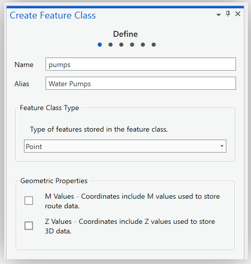

# ImpatientGIS

## Chapter 4
# Create data: Data tables, Georeferencing and XY table

*based on workshop by Stacey Maples, Geospatial Manager, stacemaples@stanford.edu Stanford Geospatial Center*

 The history of modern epidemiology is tied up with the history of mapping. 

[John Snow and Cholera Mapping History Video](https://www.youtube.com/watch?v=VJ86D_DtyWg)
  --   [(or an  alternative video)](https://www.history.com/topics/19th-century/mankind-the-story-of-all-of-us-videos-cholera-video)


**Download** the zip folder:  https://github.com/zarazaga/ImpatientGIS/tree/master/Ch4data 
Right-click the *.zip and Extract All.  

* **snow_map.png** - a non-georeferenced image of the map from John Snow’s original report on the cholera outbreak of 1854.

* **London_boroughs.shp** - the boroughs of the modern city of London.
**2018Lon_HousingBoro.csv** - table with housing and pop. density

* **Study_Area.shp** - a rectangle describing the area of interest.  

* **deathAddresses.csv**  - a table of addresses affected by the cholera outbreak, their latitude and longitude coordinates, and the number of deaths at each address.  

*backup data folder contains versions of files created during the workshop.* 

## 4.0 Look at John Snow's 'snow_map’ 
(open from within the Ch4 data folder)


This is the famous map drawn by Dr John Snow, the founding father of modern epidemiology.  London suffered a series of cholera outbreaks during the mid-19th century, and Snow theorized that cholera was spread through contaminated water, rather than the prevailing theory of spread through "miasma" in the air.  London's water supply system consisted of shallow public wells where people pumped water to carry home; the sewage system of privies emptied into cesspools or cellars. The pervasive stench made the miasma theory very plausible. 

During the 1854 cholera outbreak Snow mapped the 13 public wells and all the known cholera deaths in the Soho district, and noted the spatial clustering of cases around the Broad Street water pump.  He managed to have the pump handle removed from the Broad Street pump and the outbreak quickly subsided. Arguing against traditional medicine, Snow subsequently published a map of the epidemic to support his theory, showing the locations of the 13 wells and the addresses of the 578 cholera deaths, marked as stacked black bars.  

Explore the cholera outbreak of 1854 and re-determine whether there is evidence that the Broad Street pump is the source of the outbreak. Map the locations and numbers of the cholera deaths, and geospatially compare them to the nearest water pumps.

## 4.1 Join a data Table: Illustrate London's population density

Open a new ArcGIS Pro document and **Insert** > New Map.

Add London Borough data: **Insert** -> Add Folder -> browse to the folder which *contains* the data (not the data itself)-> OPEN. 

Browse to the folder > **data > London_Borough.shp** Drag the shapefile onto the map.  And drag the table **2018Lon_HousingBoro.csv** onto the contents file.  

  

Click on the London_borough Layer.  Open **Feature Layer** > *Data* > attribute table *( or shortcut- right-click layer)*


There isn't much useful data here, beyond the shapes of the boroughs. But there is a GSS_CODE, which will allow the connecting of this dataset to any other data-table which has the same code. Rows with matching numbers can be joined between one dataset and another. 

Open the table. **Standalone data** > Table > Attribute Table. 

Look at the attribute table to figure out first, if it shares the GSS_CODE, and secondly what data we could join to the borough layers to illustrate population density. 


PopPr_SqKm defines population density per square Km for each London borough. Join the table to the feature layer.

Select the London_borough Layer. **Feature Layer** > Data > Joins (down arrow) > Add Join. *(Shortcut: right-click on the layer > Joins & Relates > Add Join)*
Input Join Field: **GSS_CODE**; Output Join Field: **Code**


Check in the attribute table of the London_borough Layer to make sure that the join worked!

Save the joined file as a new, stable Layer in the project globaldatabase (gbd). 
**Feature Layer** > Data > Export >Feature Class to Feature Class
Output Feature Class: **London** > Run.


*(ps. the 'backup data' folder contains a joined 'London' shapefile- just in case!)*

Change the symbology of the London layer to show relative population density. 

**Feature Layer** > Appearance > Symbology > slide down to **Graduated Colors**

Field > **PopPr_sqKm** > Select *quantile* classification method to show equal numbers of boroughs per class.

 

Lable the Boroughs: **Feature Layer** > *Labeling* > ‘Label’> default Field 'Name'. 

*(For clarity one could turn off this layer while working on the new layer)*

## 4.2 Compare Historic area of disease to today's population density. 

The 'Study Area' polygon describes the zone of John Snow's study. Compare its location to the areas of density in modern London.

Catalog > drag **Study_Area.shp** onto the Map. Zoom into the small square *(or right-click to ‘zoom to Layer’)*
**Appearance** > Symbology > properties > change the fill to 'No_Color', and the border line to a strong color, to make a square frame instead of a colored square.  


### Spatial Bookmarks

To easily return to this area of interest, one can create a spatial bookmark: **Map** > Bookmarks  > New Bookmark > Name it **“SOHO”**. 

Zoom back out to the density map; and make sure the 'study area' sqaure frame is visible, then test **Map** > Bookmarks > Soho to return.

*The cholera outbreak happended in one of the densest parts of historic London.  This map encourages a discussion about areas of high historic and current population density in central London.  It would be interesting to show this population density in 3D, as in Chapter 2*.  

**Save.**
*(Turn off the 'London Boroughs' layer)*


## 4.3 Create new Data: Georeference a paper map  

To determine whether there is evidence that the Broad Street pump was the source of the cholera outbreak of 1854, one needs to know which deaths took place near which water-pumps. Each death address must be allocated to a pump according to its proximity to that pump.  
First we need the locations of the historic pumps, data which must be extracted from John Snow's original 1854 cholera outbreak map, by ovelaying the paper map onto the correct site within our GIS, and tracing the points off it. 

Catalogue > data folder > drag **snow_map.png** into the **Map**. 
*(Click Yes if you are prompted to "Build pyramids". If it doesn’t prompt, you might need to come back to this and right-click on the layer.)*

Where is it? Added to **Contents**, the layer isn't visible in the Map. Right-click > zoom to layer.  It is probably in the ocean! The GIS has no reference to identify where this map should be located in the world. 

### Georeference

Select *snow_map.png* >  **Imagery** tab > Georeference icon, to open the **Georeferencing** Tool bar > Georeference.

  

Right-click > "Zoom to layer *snow_map.png* > use the mouse scroll button to navigate to the upper left corner of the image, and find *Regent Circus* .
Georefence Ribbon > **Add Control Points** > place 'Control Point' at the center of *Regent Circus*.  
  
Right-click > "Zoom to ...  *Study_Area*> mouse scroll wheel zoom into the same area of *Regent Circus*, and place the second **GCP** link at that location. The map image will automatically "snap" these two GCP links together. *(If it remains invisible, save and close georeferencing, then re-open. This just happens sometimes)* 

  

Similarly, use the scroll wheel to navigate to the bottom right corner of the 'snow_map.png' layer to find the intersection of *Oxendon Street & Coventry Street*. This is an intersection that has remained consistent through the city development.  Add a **Ground Control Point** link at the intersection.
Toggle off the visibility of the 'snow_map.png' > right-click > Zoom to..*Study_Area*. 
Locate the corresponding intersection in the now visible basemap and place the second link of the **Control Point**. 
Turn on the 'snow_map.png' layer to check that it has "snapped" these two links together, as before. 

Locate and place 3 more **Ground Control Points** (1 in each remaining corner and one near the center).  Try Soho sqaure! 


In case of a mistake, open up the **control point table**.  Turn off each point one-by-one to see which is faulty, then select and delete that point. 
The **Georeference** tools operate within an external editing session; one needs to separately save this session with the **Save** button of the toolbar, then **Close Georeference**. 

*Observation: In Windows Explorer, browse to the **data** folder; note that new files have been added including **snow_map.png.pgwx**. This is the "World File" for the image just georeferenced; as long as this file accompanies the **snow_map.png** file, all GIS applications, such as Google Earth, ArcGIS, QGIS, etc.. should be able to co-locate this image with other datasets.*

 
## 4.4 Create new Data: Digitize features from a georeferenced map

*(If the last section didn't go well, add the `John_Snow_Map.tif` from the backup_data )* 

In order to trace, and digitize the locations of the **Water Pumps** in the neighborhood, from the paper map, an empty layer must be created in the .gdb to hold those new points.  

Catalog panel > **Databases** > right-click on **Default.gdb** > **New > Feature Class**   
  
Create Feature Class > Define >  **Name:** pumps; **Alias:** Water Pumps; **Feature Class Type:** Point > **Next**.  
  
 **Field Name:** Label; **Data Type:** Text. > **Next**.  
  
Set the **Spatial Reference** to **GCS WGS 1984** (find it under 'layers') >  **Finish**. 
   

### Add points to the Feature Class "Pumps"

Drag the new **pumps** Feature Class into the Map. The layer is added to Contents, with the alias: **Water Pumps**. 

As spatail data points are added, new fields can be added too. In preparation for this, open the **Attribute Table**: 
Select the Water Pumps layer > **Feature Layer** > Data > Attribute Table *(or right-click)*. 

Select the **Water Pumps** layer > **Edit** Tab > activate the **Edit** tools ribbon. 

  

Click on **Create** tool > a set of templates for each vector data layer appear in a  **Create Features** panel on the right.
  
From the **Water Pumps** template select the Water Pump point.   Locate a Water Pump in the **snow_map.png** image, and click on it to place the point. 
In the Attribute Table, double-click on the new record under the **Label** field and enter a text-name for the Label field (use the name of the nearest street), then hit RETURN.

Repeat for the remaining 12 water pumps in the Snow Map. (There are 13 pumps in all; some are right near the edge.) 

  
All edits within an edit-session have to be saved separately from saving the map itself. Click **Save** and confirm to save edits.  Close the **Create Features** Panel to close the edit session.
Close the Water Pumps Attribute Table.

Turn off the visibility of the snow_map layer, and zoom to the Water Pumps. 
  

## 4.5 Finding and Using an already georeferenced map online

There are many venues for searching for old maps as sources for spatial data. It is possible to scan and georeference almost any map you can find reference data (another map to georeference to) for, bearing in mind considerations of scale, authority, projections, etc.when using a scanned map as a data source.

* [earthworks.stanford.edu](earthworks.stanford.edu)
* [DavidRumsey.com](DavidRumsey.com)
* [OldMapsOnline.com](OldMapsOnline.com)

For example, this map [[Gegend von London 1853](https://www.davidrumsey.com/luna/servlet/detail/RUMSEY~8~1~298861~90066747:Gegend-von-London-1853?sort=Pub_List_No_InitialSort%2CPub_Date%2CPub_List_No%2CSeries_No&qvq=w4s:/where%2FLondon%2B%252528England%252529%2Fwhen%2F1854;q:london%201854;sort:Pub_List_No_InitialSort%2CPub_Date%2CPub_List_No%2CSeries_No;lc:RUMSEY~8~1&mi=1&trs=2)] of London on [https://davidrumsey.com](https://davidrumsey.com) already has a "Georeferenced" version, which can be viewed by clicking on the **Georeferencer** button at the top of the page.


David Rumsey makes Open Geospatial Consortium (OGC) compliant services available for  georeferenced maps on his site, hence one  can use the maps directly in most GIS applications, including ArcGIS Pro, QGIS, ArcGIS Online, etc.

### Adding the DavidRumsey.com WMTS map Service to ArcGIS Pro

Sign into the goreferencer and find the **Web Map Tile Service** (WMTS) link. 


(If you cant find it- here is a copy of the  ** (WMTS) URL** for the Gegend map:  
```http
https://maps.georeferencer.com/georeferences/28da2318-c4b3-5f25-83dc-3da27859fea2/2019-02-19T17:27:12.514288Z/wmts?key=mpIMvCWIYHCcIzNaqUSo&SERVICE=WMTS&REQUEST=GetCapabilities
```
 
This URL provides access to the georeferenced map beyond the DavidRumsey.com website.

Insert the map into ArcGIS Pro. **Insert** tab > Project group> **Connections** drop-down list > New WMTS Server. 
The **Add WMTS Server Connection** dialog box appears. Paste the URL of the WTMS server site.
In the catalog paine, the maps.georeferencer appears under the folder **Servers**. Expland the down arrow, and drag the map "Gerend von London' onto the **Map** page. It will take a while to load. 

## 4.6 Create a new Data layer from an XY table

The dataset in the folder which describes the locations where deaths from Cholera happened, is a table, not a spatial data set.  Open it. Each line in the table is an address, with the number of cases at the adress, the address writen as text, and the latitude and longitude coordinates of these addresses.  
*Notice how small the longitude number is- why?*

Catalogue > drag  ‘deathAddresses.csv file onto the contents window.

 **Map** Tab > Add Data >  **Add XY Point Data**. This will open the *‘Geoprocessing’* tools window, with the tool: **XY Table to Point**.  *(Also find under Analysis > Tools > search for ‘XY’)*. 


Under **Output Feature Class**, note that the new feature class will be exported to the ‘globaldatabase (gdb) as the default location for all new data.  
Replace the default name with "**Deaths**" and remaining settings as shown: *(make sure the coordinate system is GCS_WGS_1984)*


**Run**. Points are added to the **Map** and the new layer to **Contents**.


## 4.7 Statistics on an Attribute field  

Obtain a simple statistical snapshot of the number of deaths at each address from the data in the Attribute Table. *(Make sure the layer is selected).* 

Open the Attribute table: **Feature Layer** > Data > Attribute Table  *(Shortcut:right-click)*
 **Num_Cases** shows the number of deaths at each address. Right-click on the header of **Num_Cases** and select **Statistics**.  A histogram of the data distribution will appear over the top of the Attribute Table, and a "Distribution of Num_Cases" panel will appear in the tabbed panel area on the right. 

   

## 4.8 Proportional symbols: Show relative quantities

The dots are all alike. Change the symbology to show, with the size of the circle, the different numbers of people who died at each address.  
 **Appearance** > Symbology *(Or right-click)* Change 'Single Symbol' to **Proportional Symbols** and set Field = Num_Cases.  
 In the **Histogram** the range of values for the Num_Cases was 1-18. So set Minimum size = 1.00 and Maximum size = 18.  On the Template for **symbol** select a larger circle- say Circle 3 at (40%). 


### Set a reference scale for Zooming

The circle symbology remains the same size as one Zooms in and out of the Map, regardless of the viewing scale.  To keep it proportional change the properties of the WHOLE map-frame. 
Right-click on **Map** at the top of the **Contents** > Properties >  **General** > change the **Reference scale**  to 1:5000 > OK .
Symbols now change size along with the zooming of the map. 