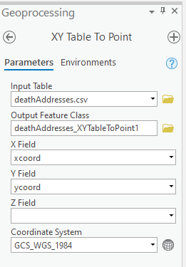
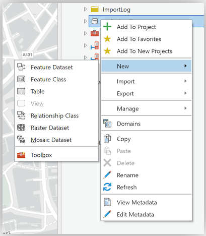

# ImpatientGIS

## Chapter 4
# Create data: join data tables, add XY tables, georeferencing and digitizing

For expediency, the data for this chapter is provided. However it could also all be gathered from online open sources.
**Download** the zip folder:  https://github.com/zarazaga/ImpatientGIS/blob/master/Ch4data.zip
Right-click the *.zip and Extract All.   

The folder contains: 

*London_boroughs.shp* - the boroughs of the modern city of London.

*2018Lon_HousingBoro.csv* - a table with housing and pop. density

*snow_map.png* - a non-georeferenced image of the map from John Snow’s original report, 1854.

*Study_Area.shp* - a rectangle describing the area of interest.  

*deathAddresses.csv*  - a table of addresses affected by the cholera outbreak, their latitude and longitude coordinates, and the number of deaths at each address. 

## 4.0 Spatial Epidemiology following John Snow. 

 *based on workshop by Stacey Maples, Stanford Geospatial Center* 
 
 The history of modern epidemiology is tied up with the history of mapping. [John Snow and Cholera Mapping History Video](https://www.youtube.com/watch?v=VJ86D_DtyWg) 


This is the famous map drawn by Dr John Snow, the founding father of modern epidemiology. *(open from within the Ch4 data folder)* London suffered a series of cholera outbreaks during the mid-19th century, and Snow theorized that cholera was spread through contaminated water, rather than the prevailing theory of spread through "miasma" in the air.  London's water supply system consisted of shallow public wells where people pumped water to carry home; the sewage system of privies emptied into cesspools or cellars. The pervasive stench made the miasma theory very plausible. 

During the 1854 cholera outbreak Snow mapped the 13 public wells and all the known cholera deaths in the Soho district, and noted the spatial clustering of cases around the Broad Street water pump.  He managed to have the pump handle removed from the Broad Street pump and the outbreak quickly subsided. Arguing against traditional medicine, Snow subsequently published a map of the epidemic to support his theory, showing the locations of the 13 wells and the addresses of the 578 cholera deaths, marked as stacked black bars.  

Locate the area of the outbreak in today's London, comparing areas of urban density.  Then  further explore the cholera outbreak of 1854 and re-determine whether there is evidence that the Broad Street pump was the source of the outbreak, by mapping the locations of the cholera deaths, and spatially comparing them to the sites of the water pumps.

## 4.1 Join a table to a spatial layer: 

The first task is to calculate, and illustrate, London's population density.  

Open a new ArcGIS Pro document and **Insert** > New Map.
Add London Borough data: **Insert** -> Add Folder -> browse to the folder which *contains* the data (not the data itself)-> OPEN. 

IN the catalogue browse down to the folder > **data > London_Borough.shp** Drag the shapefile onto the map.  

  

What attribute might be used to illustrate population density? Search for a population attribute: click on the *London_borough* Layer.  Open **Feature Layer** > *Data* > attribute table *( or shortcut- right-click layer)*


While the area of the borough is here there is no useful data about population.  Note there is a column called *GSS_CODE*. 

There are different kinds of tables in GIS. An attribute table shows the data available about a feature-set- it shows the linked data for a GIS layer, once it is already spatially visualised. 

Drag the table **2018Lon_HousingBoro.csv** onto the contents file.  This table is a .csv file, with comma separated values (which can be exported from excel). It can have all kinds of data - but in this case it doesnt have any lat-long information or other spatial data.

Open the table. **Standalone data** > Table > Attribute Table. 

Look at the attribute table and note, first, that it also has that same column called GSS_CODE. The same data information in two tables allows us to join one data-set to another, so that rows with matching CODE numbers can be joined - connecting the additional information to the spatial dataset. Study the dataset further to ensure that the GSS_CODE is indeed common to both, and secondly to see what data cam be joined to the borough shape layers to illustrate population density. 


*PopPr_SqKm* defines population density per square Km for each London borough. 

### Join the table to the feature layer.

Select the London_borough layer. **Feature Layer** > Data > Joins (down arrow) > Add Join. *(Shortcut: right-click on the layer > Joins & Relates > Add Join)*
Input Join Field: **GSS_CODE**; Output Join Field: **Code**


Check the attribute table of the London_borough Layer to make sure that the join worked! The layer should have the additional columns added on at the end of the row.

Save (or export) the joined file to create a new, stable layer of combined data in the project globaldatabase (gbd). 
**Feature Layer** > Data > Export >Feature Class to Feature Class.  
Output Feature Class: **London** > Run.


*(note. the 'backup data' folder contains a joined 'London' shapefile- just in case!)*

Create a map with london borougs illustrating population density.
The symbology should probably be graduated colors, showing relative population density; a classification method should be selected, and lables shown.

**Feature Layer** > Appearance > Symbology > slide down to **Graduated Colors**

Field > **PopPr_sqKm** >  *quantile* classification method, (a good choice to show equal numbers of boroughs per class).
Label the Boroughs: **Feature Layer** > *Labeling* > ‘Label’> default Field 'Name'. 
 

 
 

## 4.2 Compare historic area of disease to modern population density. 

The *Study Area8* polygon describes the zone of John Snow's study. Compare its location to the areas of density in modern London.

Catalog > drag **Study_Area.shp** onto the Map.  Zoom into the small square *(or right-click to ‘zoom to Layer’)*.  Make a square frame instead of a colored square; change the fill to 'No_Color', and the border line to a contrasting color.
**Appearance** > Symbology > properties > 


### Spatial Bookmarks

To easily return to this area of interest, one can create a spatial bookmark: **Map** > Bookmarks  > New Bookmark > Name it **“Soho”**. 

Zoom back out to the density map, make sure the 'study area' sqaure frame is visible, then test the Bookmarks to return to Soho.

*The cholera outbreak happended in one of the densest parts of historic London.  This comparitive map encourages a discussion about areas of high historic and current population density in central London.  It could be interesting to also show this population density in 3D*.  

**Save.** [remember there is no autosave in GIS]

## 4.3 Create new Data: make a layer from an XY table

Add the data for the cholera deaths. In the data folder, the dataset which describes the cholera-death locations is a table, not defined as a spatial data set.  In Pro, **Catalogue** > drag  ‘deathAddresses.csv into the contents window. Open and study the table: **Standalone Table** Tab > Data > Attribute Table.  Each line in the table is an address, with the number of cases at the adress, the address (as text), and the xcoordinate and y coordinates of that adress. *Which one is latitude. or longitude?  Notice how small the longitude number is- why?*

Use the Geoporcessing tool: add XY point data, which allows one to specify unidentified columns as lat. and long. data. 

 **Map** Tab > Add Data >  **Add XY Point Data**. This will open the *‘Geoprocessing’* window and the tool: **XY Table to Point**.  *(or search under Analysis > Tools > search for ‘XY’)*. 



Note under *Output Feature Class* that the new feature class is saved in the ‘globaldatabase (gdb) as default.  
Replace the Output Feature Class name with "**Deaths**" and the remaining settings as shown: *Make sure the coordinate system is set to 'GCS_WGSS_1984' so that the data can be recognised on a long/lat system.* **Run**. Points are added to the **Map** and the new layer to Contents.


## 4.4 Proportional symbols: Show relative quantities

The dots are all alike. Change the symbology to show, with the size of the circle, the different numbers of people who died at each address.  
 **Appearance** > Symbology *(Or right-click)* Change 'Single Symbol' to **Proportional Symbols** and set Field = Num_Cases.  
 In the **Histogram** the range of values for the Num_Cases was 1-18. So set Minimum size = 1.00 and Maximum size = 18.  On the Template for **symbol** select a larger circle- say Circle 3 at (40%). 


  

## 4.5 Create new Data: Georeference a paper map  

To identify the volumne of deaths around each water-pump, one needs to be able to relate these addresses to the spatial location of the pumps. To create a new historic-pump dataset, the original 1854 paper map must be overlaid onto the correct site in our GIS, and the pump-locationed traced from it. 
*( For clarity turn off the 'London Boroughs' layer)*

Catalogue > data folder > drag **snow_map.png** into the **Map**. 
*(Click Yes if you are prompted to "Build pyramids". If it doesn’t prompt, you might need to come back to this and right-click on the layer.)*

Where is it? The layer isn't visible in the Map. Right-click > zoom to layer, it is probably in the ocean at 'null island' again! The GIS has no reference to identify where this map should be located in the world. 

### Georeference

Move the map to the correct location in the world, and stretch and scale it to a best match. 

Select *snow_map.png* >  **Imagery** tab > Georeference icon, to open the **Georeferencing** Tool bar > Georeference.

  

Choose place on the map that can be matched to contemporary sites in the city. Right-click > "Zoom to layer *snow_map.png* > use the mouse scroll button to navigate to the upper left corner of the image, and find *Regent Circus* .
Georefence Ribbon > **Add Control Points** > place 'Control Point' at the center of *Regent Circus*.  
  
Right-click > "Zoom to ...  *Study_Area*> mouse scroll wheel zoom into the same area of *Regent Circus*, and place the second **GCP** link at that location. The map image will automatically "snap" these two GCP links together. *(If it remains invisible, save and close georeferencing, then re-open. This just happens sometimes)* 

  

It's best to use points at opposite sides of the paper map. However on the bottom right *Prices street*, has changed name. The intersection at *Oxendon Street & Coventry Street* has remained consistent.  Add a **Ground Control Point** link at the intersection.
Un-click visibility of the 'snow_map' > right-click > Zoom to *Study_Area*. Locate the corresponding intersection in the basemap and place the second **Control Point**. 
Turn on the 'snow_map.png' layer to check that it has "snapped" the links together. 

Locate and place 3 more **Ground Control Points** (1 in each remaining corner and one near the center).  Try Soho sqaure! 


In case of a mistake, open up the **control point table**.  Turn off each point one-by-one to see which is faulty, then select and delete that point. 
The **Georeference** tools operate within an external editing session; one needs to separately save this session with the **Save** button of the toolbar, then **Close Georeference** on the top ribbon, to finish the editing session. 

*Observation: In windows explorer, browse to the **data** folder; note that new files have been added including **snow_map.png.pgwx**. This is the "World File" for the image just georeferenced; as long as this file accompanies the **snow_map.png** file, all GIS applications, such as Google Earth, ArcGIS, QGIS, etc.. can co-locate this image.*


 
## 4.6 Create new Data: Create a new Feature Set, & Digitize features from a georeferenced map

*(If the last section didn't go well, add the georeferenced `John_Snow_Map.tif` from the backup_data )* 

In order to trace and digitize the locations of the **Pumps** from the paper map, an empty layer must be created in the .gdb to hold those new points.  

Catalog panel > **Databases** > right-click **Default.gdb** > **New > Feature Class**  (the gdb could have the saved file name)
  
Create Feature Class > Define >  **Name:** pumps; **Alias:** Water Pumps; **Feature Class Type:** Point > **Next**.  
  
Add a new test field for the pump name called *label*.

 **Field Name:** Label; **Data Type:** Text. > **Next**.  

Leave the **Spatial Reference** default **Bitish National Grid**. *(A projected system, this reference will allow for accurate measurements in meters, rather than degrees)*.  

Drag the new **pumps** Feature Class into the Map. The layer is added to Contents, with the alias: **Water Pumps**. In order to be able to add the names of the pumps, open the attribute table, and leave it open. *(reminder: Water Pumps layer > Feature Layer > Data > Attribute Table /or right-click)*. 

### Editing: add points to a Feature Class

Any drawing or editing on a GIS layer is done under the **Edit** ribbon.
Select **Water Pumps** layer > **Edit** Tab > activate the **Edit** tools ribbon. 

  
  
Click on **Create**  > a set of templates for each vector data layer appear in a **Create Features** panel on the right.
From the **Water Pumps** template select the Water Pump point.   Locate a Water Pump in the **snow_map.png** image, and click on it to place the point. Tick the 'check mark' in the floating tool-bar.
In the Attribute Table, double-click on the new record under the **Label** field and enter a text-name for the Label field (use the name of the nearest street), and RETURN to save.

Repeat for the remaining 12 water pumps in the Snow Map. (There are 13 pumps in all; one is almost hidden along the border right near the edge.) 


  
As with the georeferencing process, all edits within an edit-session have to be saved separately from saving the map-file itself. Click **Save** and confirm to save edits.  Close the **Create Features** panel to close the edit session, and close the attribute table.

Make the new GIS data ready to use; turn off the paper-map, and label the pumps. *(reminder: Feature Layer > Labeling > Label > Field: label)*.


## 4.7 Finding and Using an already Georeferenced map online

There are many venues for searching for old maps as sources for spatial data. It is possible to scan and georeference almost any map you can find reference data for (another map to georeference to) bearing in mind considerations of scale, authority, projections, etc.when using a scanned map as a data source.

* [earthworks.stanford.edu](earthworks.stanford.edu)
* [DavidRumsey.com](DavidRumsey.com)
* [OldMapsOnline.com](OldMapsOnline.com)

For example, this map [[Gegend von London 1853](https://www.davidrumsey.com/luna/servlet/detail/RUMSEY~8~1~298861~90066747:Gegend-von-London-1853?sort=Pub_List_No_InitialSort%2CPub_Date%2CPub_List_No%2CSeries_No&qvq=w4s:/where%2FLondon%2B%252528England%252529%2Fwhen%2F1854;q:london%201854;sort:Pub_List_No_InitialSort%2CPub_Date%2CPub_List_No%2CSeries_No;lc:RUMSEY~8~1&mi=1&trs=2)] of London on [https://davidrumsey.com](https://davidrumsey.com) already has a "Georeferenced" version, which can be viewed by clicking on the **Georeferencer** button at the top of the page.


David Rumsey makes Open Geospatial Consortium (OGC) compliant services available for  georeferenced maps on his site, hence one  can use the maps directly in most GIS applications, including ArcGIS Pro, QGIS, ArcGIS Online, etc.

### Adding the DavidRumsey.com WMTS map Service to ArcGIS Pro

Sign into the goreferencer and find the **Web Map Tile Service** (WMTS) link. 


(If you cant find it- here is a copy of the  ** (WMTS) URL** for the Gegend map:  
```http
https://maps.georeferencer.com/georeferences/28da2318-c4b3-5f25-83dc-3da27859fea2/2019-02-19T17:27:12.514288Z/wmts?key=mpIMvCWIYHCcIzNaqUSo&SERVICE=WMTS&REQUEST=GetCapabilities
```
 
This URL provides access to the georeferenced map beyond the DavidRumsey.com website.

Insert the map into ArcGIS Pro. **Insert** tab > Project group> **Connections** drop-down list > New WMTS Server. 
The **Add WMTS Server Connection** dialog box appears. Paste the URL of the WTMS server site.
In the catalog paine, the maps.georeferencer appears under the folder **Servers**. Expland the down arrow, and drag the map "Gerend von London' onto the **Map** page. It will take a while to load. 

[Continue to Chapter 5](https://github.com/zarazaga/ImpatientGIS/blob/master/Impatient_Ch5.md)

