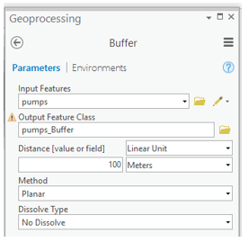
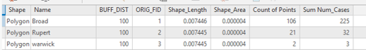
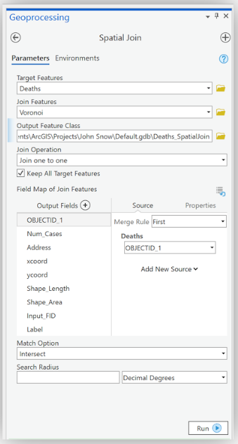

# ImpatientGIS

## Chapter 5
# Geoprocessing.

*based on workshop by Stacey Maples, Geospatial Manager, stacemaples@stanford.edu Stanford Geospatial Center*

## 5.0 Spatial Data Analysis: Geoprocessing Tools

The Analysis tools gallery gives access to a  subset of the most powerful and commonly used spatial analysis tools. Analysis > Tools gallery. A few common tools appear as icons in the **tools** box but the full set of tools is under >  **Tools** > opening the **Geoprocessing** panel > clicking on **Toolboxes** to see ALL the tools. 

## 5.1 Buffer
First demonstrate how many deaths occured near each pump with a simple analysis. Is it's useful to know how many died within a 100 meter buffer around each pump?

**Analysis** > Tools > **Buffer** (geoprocessing panel opens).

Input: **pumps**; 
Output: pumps_Buffer (this is default); 
Distance : **100  Meters**.  > **Run**.

Some buffers contain many deaths, and others contain fewer. (It isn't very clear, visually, which pump is primary). Count the number of cases within each buffer.   

## 5.2 Summarize within 
*How many homes with deaths are within each polygon?*
**Analysis** > Tools > Geoprocessing Panel > Find Tools- Search Box> search for **“summarize” > summarize within**.

Input: **pumps_buffer**, and add the features from the **deaths** layer.  
Summary Fields: **Num_cases: Sum** (to add all cases within each buffer) > **Run**.

Open the Attribute table.
Each buffer ring has a different number of cases.

Illustrate the difference in quantity within each buffer by color: in **symbology** use Graduated colors, Field: Sum Num_Cases.   
Try different **Classification** methods to test what this reveals about the data. 

After all, this wasn’t very useful representation. Buffers are not useful here, because there are many points outside the buffers. *Where did those people get their water?  Which is their closest pump.*  Test another tool.

## 5.3 Voronoi (Thiessen) polygon (Spatial Allocation)

Thiessen polygons allocate all the space in an area of interest, focused around a single feature per polygon. That is, within a Thiessen polygon, all locations are closer to the point that was used to generate that polygon than to any other point in the set. Create a set of Thiessen polygons based upon the locations of the **Water Pumps**. Then allocate all of the points in the death addresses dataset to the polygon around the nearest water pump, using a simple spatial join.

 **Analysis tab** > Tools > Geoprocessing panel> Find Tools> search for **Voronoi** > **Create Thiessen Polygons** tool.

Options as: Input Features:**Water Pumps**; Output Feature Class: **Voronoi**; Output Fields: **All fields**. 

To ensure the whole map area is included, beyond jsut the limits of the pump-points, manually set the **Extent** of the spatial calculation to the limits of the 'study area' box.  **Analysis** > Environments > set Extent: **Same as:Study_Area**; > Run.  

The result creates a layer of irregular polygons generated around each water pump.   Open the Attribute table of the new Voronoi layer. It contains the fields from the **Water Pumps**, including the **Label** field.  Make the lables visible: **Feature Layer** > Labeling Tab > Label (field is Label).

 

## 5.4 Summarize within (again)

Try using **Summarize within** for the Voronoi polygon layer, to see how many homes are within each polygon.
**Analysis** > Tools > Geoprocessing Panel > **summarize within**.
Input: **Voronoi**, and features from the **deaths** layer; 
Summary Fields: **Num_cases: Sum** (add all the cases within each polygon)  > Run.

Open the **Attribute Table**.  Note the total cases connected to each pump: clearly the Broad street pump is culpable.  

## 5.5 Spatial Join (Point Aggregation)
For each individual death, the original table shows only the address; it would be statistically useful to define which pump is attributed (or closest) to that address.  To “allocate” a specific pump, determine, for each adress. whichVoronoi polygon it falls within.  A **Spatial Join** can add the polygon’s attribute (pump name) to each **death address** point. 

**Analysis** > Tools > Spatial Join > to open the **Spatial Join** Geoprocessing tool. 
(*shortcut: right-click on deaths layer> Joins and Relates>Spatial Join.)* 
 Join Features: **Voronoi**; Output Feature Class: **Deaths_Allocated**. 

  

The new layer **Deaths_Allocated** is added to the **Contents**. 
Open the **Attribute Table**. Each record has the "Label" for the the nearest Water Pump.

## 5.6 Summary Statistics

Statistically, summarize the deaths in the outbreak, grouping the summary by the Water Pumps allocated to each Death Address. The **Summary Statistics Tool** allows a statistical summary similar to the one performed on the entire data set, but this time grouped by pump.

With **Deaths_Allocated** Attribute Table open > right-click on the header of **Num_Cases** column > Summarize > **Summary Statistics** Geoprocessing tool table.
Set the Statistics Fields as shown:  
  

The **Case field** is set as **Label** column, which is the pump-name, in order to group the summary by nearest **Water Pump**. > Run.

Right-click the resulting **Deaths_Allocated_Statistics** table to open it. Right-click on the **SUM_Num_Cases** field header and select **Sort Descending**  
  

## Basic Measures of Spatial Central Tendency

## 5.7 Spatial Mean (Mean Center)

The Mean Center is defined by the average x- and y-coordinate of all the features in the study area. It's useful for tracking changes in the distribution or for comparing the distributions of different types of features. Use the Mean Center to highlight the distribution of deaths around the Broad Street Pump.  

First, calculate a simple spatial mean. This is simply the mean center of the **distribution of locations** 

 **Analysis** > Tools > Geoprocessing Panel > *Find Tools* Search Box,  **Mean Center** geoprocessing tool.
Input Feature Class: **Deaths_Allocated** Output Feature Class: a meaningful name > **Run**.

The new Layer added to the Map has a single feature: the *Spatial Mean* of the distribution of *addresses* at which deaths took place. That is, we have determined the *Spatial Mean of the effected addresses*, however it is not the Spatial Mean of all of the deaths in the neighborhood, since some addresses had many. 

## 5.8 Weighted Spatial Mean
Use the Num_Cases field to calculate the *Spatial Mean* of all deaths in the outbreak, by calculating a **Weighted Spatial Mean**

Run the **Mean Center tool** again, this time assigning the ***Weight Field*: Num_Cases**. Rename the Output Feature Class (add a "W" to the end of the filename).
Change the color patch for the resulting layer to one that contrasts with that of the previous, unweighted Mean. 

While the change is slight in this relatively small distribution of points, there is still a noticeable movement of the **Weighted Spatial Mean** towards the Broad Street Pump. 

## 5.9 Standard Distance

The **Standard Distance** is the spatial statistics equivalent of the standard deviation. It describes the radius around the spatial mean (or weighted spatial mean), which contains 68% of locations in a dataset. It can be very useful for working with GPS data.

**Analysis** > Tools > Geoprocessing Panel > *Find Tools* Search Box > 
*(or short-cut: Geoprocessing Tab >Back Arrow)* 
Standard Distance > **Standard Distance tool**
Input Feature Class: **Deaths_Allocated** ; 
**Output Standard Distance Feature Class**: add a "1" to the name. Confirm  'Circle Size': **1 standard deviation**; Weight Field: **Num_Cases** > Run.

#### Bonus:  
Run the **Standard Distance** again, this time without a **Weight** field and observe the results. This calculates Standard Distance based upon the **LOCATIONS**. What effect has that had on the Standard Distance? Why?

*

## 4.10 Creating a Raster Surface from Point Data: Hotspots
## a. Symbology: Hot Spots

Hotspot mapping is a popular technique for quickly identifying spatial structures in data. You have the software "interpolate" or guess the values of the entire study area, based upon the discrete samples of each pump that our **Deaths_Allocated** points represent. 

ArcGIS Pro has a default hotspot tool under symbology. Turn off all but  **Water Pumps** and **Deaths_Allocated_UTM** point layers, and Visualise the layer **Deaths_Allocated_UTM** as a hotspot.

## b. Kernel Density

The Kernel Density Tool calculates a magnitude per unit area from the point features using a kernel function to fit a smoothly tapered surface to each point. The result is a raster dataset which can reveal “hotspots” in the array of point data, and which can be weighted by a population field within the point data.

Turn off all but the **Water Pumps** layer.
**Analysis** > Tools > Geoprocessing Panel > Search for **Kernel Density** 
Use the following settings:

|              Setting: | Value                  |
|----------------------:|------------------------|
| Input point features: | Deaths\_Allocated\_UTM |
|     Population field: | Num_Cases              |
|        Output raster: | DeathTopo              |
|     Output cell size: | 1                      |
|        Search radius: | 50                     |
|           Area units: | Square kilometers      |
|   Output cell values: | Densities              |
|               Method: | PLANAR                 |  

The "Hottest" spot on the resulting map lies directly beneath the **Broad Street Pump**

 

END CHAPTER HERE

*CHECK THIS_ THIS MAY NO LONGER BE THE CASE WITH BRITISH GRID..The resulting Standard Distance circle, is, stragely, not a circle. This is because we used unprojected data (using long.and lat. degrees) for the calculation.  Geoprocessing tools that measure distance and area have trouble with this- since area is in segments of degrees. At the bottom of the Geoprocessing panel note that Standard Distance completed with warnings. Hovering the mouse reveals more error information and a clickable link.*  

### 5. Define a new Geographic Projection, and Export data

*Translate the **Deaths_Allocated** dataset to a new projected version.Select a Coordinate System that is *Projected* (flattened), instead of *Geographic* (curved on the earth's surface), in order for it to be appropriate for measuring distance and area in meters at the scale of our project. **Export** the existing dataset to create a new layer with the new projection.  Choose a UTM (Universal Transverse Mercator) projection defined for this longitude, 30 North.* 

Select the layer.  **Feature Layer** > Data Tab > **Export Features** *(or right-click>Deaths_Allocated layer > Data>Export Features)* 
Output Feature Class: **Deaths_Allocated_UTM** 

Click on the word **Environment**, at the top of the Geoprocessing Panel> Click on the **Globe icon** at the right of the drop-down > expand the Layers section. (The shows the multiple different projections of different layers in your map, and other available options) > Select **WGS 1984 UTM Zone 30N** projection > click **OK** > RUN.**

Run the **Standard Distance** geoprocessing tool again, with the new Input Feature Class: **Deaths_Allocated_UTM**.  The result should now be a circle, whose diameter encompasses 68% of the **Deaths** in the dataset.

