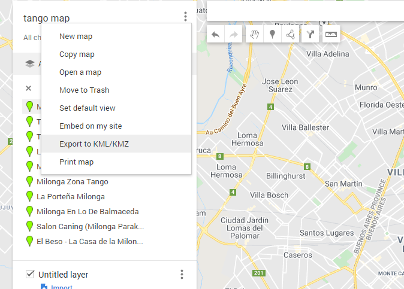

# ImpatientGIS

## Chapter 6
# make new data: gather, survey and edit data

create data in a survey, import KML from google, and draw new data

## 6.0 make new data

New datasets need a geometry (points, lines, polygons) and attributes- location (lat/long) and other data which connects to that information.  Much existing spatial data online is not in an esri 'shapefile'. 
## 6.1 download and import geojson data
Much open source data is directly in java-script code. 

remove the .txt  to save it directly as .geojson

strangely stretched out- south america 
   omit this image- right click on Map and go to properties. HERE I CAN EXPLAIN ABOUT geographic and projected co-ordinate systems? 

## 6.1 export and import data from google
  google 'my maps'

milonga search in google - 
 add the data to an untitled layer. (one can add more tango vanues- with additional searches)

Change the symboloty of the points (feature layer - appearance - symbology) and change them to single symbol. 

change the basemap to light grey reference to turn off the text.
Ask a question- For example, which public spaces are within 100m of a tango milonga location to have an outdoor festival?
 la portenia milonga is near a long park - 
 Milonga Balmaceda is near the Plaza Moreno.

## 6.2 edit and draw points and polygons into a dataset

The data is incomplete. This often is the case. There is one Tango location which you know about, but that is not showing up - La Viruta, which is located in the area of the city near the corner of Armenia and Jose Cabrera- near the two overlapping sites (Salon Caning).

THe editing session is a separate program- outside the GIS analysis context- one has to remember to save edits before returning to the map, or everything can go wrong. (If you find things are not working, its a good think to check- did I remember to save edits?)
add in the information into the attribute table
name: La Viruta   Save Edits again. 

## 6.3 create data in a site survey
A more systematic, yet simple, way to gather and add data points and the accompanying attributes, can be to create a survey, and then go on site and collect the data you need. The ESRI suite of tools includes Survey 123 and Collector. For longer term and complex collection strategies, Collector has more options. It is ideal for a company that wants to have employees collect daily data. But for impatient scholars, Survey 123 is excellent. 
Go to Survey 123 on the web  https://survey123.arcgis.com/ 