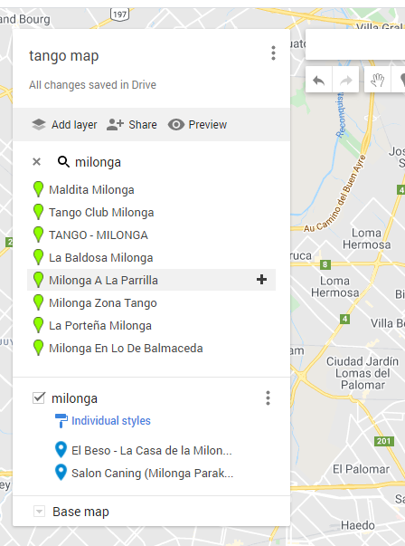

# ImpatientGIS

## Chapter 6
# make new data: gather, survey and edit data

create data in a survey, import KML from google, and draw new data

## 6.0 make new data

New datasets need a geometry (points, lines, polygons) and attributes- location (lat/long) and other data which connects to that information.  Much existing spatial data online is not in an esri 'shapefile'. 
## 6.1 download and import geojson data
Much open source data is directly in java-script code. 

remove the .txt  to save it directly as .geojson

strangely stretched out- south america 
   omit this image- right click on Map and go to properties. HERE I CAN EXPLAIN ABOUT geographic and projected co-ordinate systems? 

## 6.1 export and import data from google
  google 'my maps'

milonga search in google - 
 add the data to an untitled layer. (one can add more tango vanues- with additional searches)

Change the symboloty of the points (feature layer - appearance - symbology) and change them to single symbol. 

change the basemap to light grey reference to turn off the text.
Ask a question- For example, which public spaces are within 100m of a tango milonga location to have an outdoor festival?
 la portenia milonga is near a long park - 
 Milonga Balmaceda is near the Plaza Moreno.
there is one that is not shwoing up - La Viruta, near the corner of Armenia and Jose Cabrera- near the Two overlapping sites (salon Caning)

THe editing session is a separate program- outside the GIS analysis context- one has to remember to save edits before returning to the map, or everything can go wrong. (If you find things are not working, its a good think to check- did I remember to save edits?)
add in the information into the attribute table
name: La Viruta   Save Edits again. 

## 6.2 edit and draw points and polygons into a dataset
## 6.3 create data in a site survey
